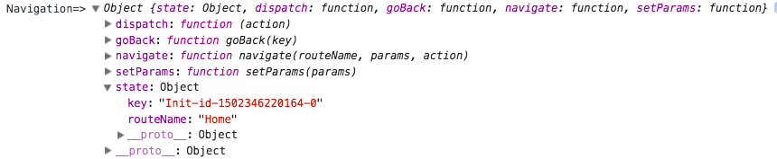

# ReactNative控件 - Navigator

从 0.44 版本开始 `react-native` 包下的 `Navigator` 已经不推荐使用

目前推荐的是 [`react-navigation`](https://reactnavigation.org/docs/navigators/) 这个库

[Demo](https://github.com/react-community/react-navigation/blob/master/examples/NavigationPlayground/js/)

安装

`npm install --save react-navigation`

内置的几种导航栏，可以嵌套使用

## 渲染屏幕

应用屏幕是通过 `React` 组件来渲染的，而 `Navigator` 也是一个 `React` 组件

## 简单使用

### [`StackNavigator`](https://reactnavigation.org/docs/navigators/stack)

导入 `import { StackNavigator } from 'react-navigation';`

API `StackNavigator(RouteConfigs, StackNavigatorConfig)`

- `RouteConfigs`

组件标识名：路线配置的映射对象，路线配置信息格式如下

```javascript
StackNavigator({
  // 定义一个以 Profile 为标志的路由配置，对应的 Screen 如下定义为 ProfileScreen
  Profile: {
    // 需要渲染的组件
    screen: ProfileScreen,
    // Optional: When deep linking or using react-navigation in a web app, this path is used:
    // The action and route params are extracted from the path.
    path: 'people/:name',
    // Optional: Override the `navigationOptions` for the screen
    navigationOptions: ({navigation}) => ({
      title: `${navigation.state.params.name}'s Profile'`,
    }),
  },
  ...MyOtherRoutes,
  ,{
    initialRouteName: 'Home', // 默认显示界面
    initialRouteParams : {...},  //默认的路由参数，可以通过 this.props.navigation.state.params 访问
    //设置默认的 navigationOptions，可以被 RouteConfigs 上的或者组件内 static navigationOptions 覆盖
    navigationOptions: {
        title : 'title', //作为headerTitle ，tabBarLabel的后备选项，这个选项是通用的
        header : ... ,//自定义 header
        headerPressColorAndroid : '#ffffff' ,//Android 5.0 的 ripple 颜色
        gesturesEnabled : true,  //右滑结束
    },
    //可视化参数
    mode: ['card'|'modal'],  // 页面切换模式, 'modal' 只对 ios 有效
    headerMode: ['screen'|'float'|'none'], // 导航栏的显示模式, screen: 有淡入淡出, none: 隐藏导航栏
    transitionConfig : ()=> {....} //返回一个重写转场动画的对象
    onTransitionStart: ()=>{ console.log('onTransitionStart'); },
    onTransitionEnd: ()=>{ console.log('onTransitionEnd'); }
  }
});
```

`screen` 指定了要跳转的组件，记得 `import`，`path` 和 `navigationOptions` 可选，其中 `navigationOptions` 中可以在 `RouteConfigs` 和 `StackNavigatorConfig` 中配置，一个是配置于特定的 Screen，另外一个则是通用的，可以配置的信息比较多，如标题、自定义 `Header` 的信息，看官方文档描述，另外 `navigationOptions` 还可以如形式配置

```javascript
class XXX extends Component {
  // Nav options can be defined as a function of the screen's props:
  static navigationOptions = ({navigation}) => ({
      herder: toolbar(),
    });
}
```

### [`TabNavigator`](https://reactnavigation.org/docs/navigators/tab)

导入 `import { TabNavigator } from "react-navigation";`

带 `Tab` 分类，类似 `TabLayout`

API `TabNavigator(RouteConfigs, TabNavigatorConfig)`

`RouteConfigs` 部分和之前一样，`TabNavigatorConfig` 可以定义展示位置、样式、标题、是否懒加载等

```javascript
// 注册tabs
const Tabs = TabNavigator({
    Music: {
        screen: Music,
    },
    Video: {
        screen: Video,
        {
          title:"" ,  //tabBarLabel 的后备选项
          tabBarVisible:"", //某个 tab 页面的 tabbar 是否显示
          tabBarIcon: , //icon 元素或者返回 icon 元素方法
          tabBarLabel:'', //Label 元素或者返回 Label 元素方法 或字符串
        }
    }
    , {
      tabBarComponent:[TabBarTop|TabBarBottom], //两种样式对应 ios 和 android
      tabBarPosition: ['bottom'|'top'], //位置
      swipeEnabled: false, // 是否可以左右滑动切换tab
      animationEnabled: false, // 切换页面时是否有动画效果
      lazy : false, //按需加载
      backBehavior: ['none'|'initialRoute'], //按 back 键是否跳转到初始 tab
      initialRouteName : 'Home' , //初始 tab
      order : ['Video','Music'],//Array 对象，tab 的排列顺序
      paths : //重写 `RouteConfigs` 中的 path
      tabBarOptions: {  //Android 和 IOS 有不同的选项
          activeTintColor: '#ff8500', // 文字和图片选中颜色
          inactiveTintColor: '#999', // 文字和图片未选中颜色
          showIcon: true, // android 默认不显示 icon
          showLabel: true, //是否显示 tab 标题
          pressColor: '#xxxxxx',  //ripple 效果颜色，5.0以上
          scrollEnabled: true,  //false，tabs 默认占满屏幕
          tabStyle: {
            width: 100,    
          },
          iconStyle : { ... }
          indicatorStyle: {
              height: 0  // 如TabBar下面显示有一条线，可以设高度为0后隐藏
          },
          style: {
              backgroundColor: '#fff', // TabBar 背景色
              height: 44,
          },
          labelStyle: {
            fontSize: 12,
          },
      },
    }
});
```

### [`DrawerNavigator`](https://reactnavigation.org/docs/navigators/drawer)

导入 `import {DrawerNavigator} from 'react-navigation';`

抽屉样式

API `DrawerNavigator(RouteConfigs, DrawerNavigatorConfig)`

`RouteConfigs` 和上面基本一样，`DrawerNavigatorConfig` 可以定义展示位置、样式等

```javascript
const SimpleDrawer  = DrawerNavigator(
  {
    music:{
    screen:MusicTab,
    navigationOptions: {
      title: 'MusicTitle',
    },
    },
    video:{
    screen:VideoTab,
    navigationOptions: {
      title: 'VideoTitle',
      drawerLabel : 'VideoLabel',
      drawerIcon : ({ tintColor }) => (
      <Image
        source={require('./notif-icon.png')}
        style={[{tintColor: tintColor}]}
      />
    ),
    },
    },
  },{
    drawerWidth : 100 ,
    drawerPosition : ['right'|'left'],
    initialRouteName : 'Home' , //初始页面
    backBehavior: ['none'|'initialRoute'], //按 back 键是否跳转到初始页面
    order : ['Video','Music'],  //Array 对象，页面的排列顺序
    contentComponent: props => <ScrollView><DrawerItems {...props} /></ScrollView>, //自定义抽屉组件
    contentOptions :{
        items:,
        activeItemKey : '#e91e63',
        activeTintColor : '#e91e63',
        activeBackgroundColor : '#e91e63',
        onItemPress : (route) => { console.log("item press");},
        style: ...,
        labelStyle: ...,
    }  
  }
);
```

## Navigation 的可用属性

使用 `Navigator` 整合后的每一个 Screen（可能是用户定义的组件也可能是嵌套使用的 Navigator） 都会得到一个 `navigation` 属性，可以通过 `this.props.navigation` 来访问，包含着以下一些属性



- `navigate` 方法，可以用来跳转到其他界面

  可以接受三个参数 `navigate(routeName, params, action)` ，分别是组件注册到 `Navigator` 的名字，传递到下一个界面的参数对象，`action` 如果该界面是一个 `navigator` 的话，将运行这个 `action`

  例子

  ```javascript
  class HomeScreen extends React.Component {
  render() {
    const {navigate} = this.props.navigation; //取出  navigation.navigate
    return (
      <View>
        <Text>This is the home screen of the app</Text>
        <Button
          onPress={() => navigate('Profile', {name: 'Brent'})}
          title="Go to Brent's profile"
        />
      </View>
     )
   }
  }
  ```

- `state`，当前屏幕的路由信息和状态

  通过 `this.props.navigation.state` 形式获得，返回的对象格式如下

  ```javascript
  {
  //当前组件注册到 Navigator 的 RouteConfigs 中对应的名字
  routeName: 'profile',
  //a unique identifier used to sort routes
  key: 'main0',
  //可选的界面间传递的参数，由  navigate 决定的
  params: { hello: 'world' }
  }
  ```

- `setParams`，用来修改路由中的参数

  修改 `state` 中的 `params`，从而刷新界面

- `goBack`，用来帮助进行页面返回

  结束当前页面，返回上一个页面，可以接收参数

- `dispatch`，分发 `action` 到路由，支持以下类型

  `Navigate`、`Reset`、`Back`、`Set Params`、`Init`

**需要注意的是**：如果界面组件是一个 `Navigator`，如 `TabNavigator`，可以只有 `state` 和 `dispatch` 两个属性，[详细描述](https://reactnavigation.org/docs/navigators/navigation-prop)

## Navigation Actions

`navigation.dispatch()` 方法接收一个 `Action` 对象，有以下 5 种类型 `Action` 对象

- Navigate

这个 `Action` 用来执行跳转，和 `navigate` 方法的作用一样

```javascript

import { NavigationActions } from 'react-navigation'  //需要导入 NavigationActions 这个组件

const navigateAction = NavigationActions.navigate({
  routeName: 'Profile', //
  params: {},
  action: NavigationActions.navigate({ routeName: 'SubProfileRoute'}) //如果导航到的是 navigators,则继续执行新的 action
})

this.props.navigation.dispatch(navigateAction)
```

- Reset

  `Reset` 操作会清除原来的路由状态，并设置为特定的状态，由 `index` 和 `actions` 数组组成

```javascript
import { NavigationActions } from 'react-navigation'
const resetAction = NavigationActions.reset({
  index: 1, //指定当前的路由，重设为当前页面为 Setting，并在 Profile 页面之上，后退展示 Profile 页面
  actions: [
    NavigationActions.navigate({ routeName: 'Profile'}),
    NavigationActions.navigate({ routeName: 'Settings'})
  ]
})
this.props.navigation.dispatch(resetAction)
```

- Back

和 `goBack` 方法一样，接受一个 `key` 参数

```javascript
import { NavigationActions } from 'react-navigation'

const backAction = NavigationActions.back({
  key: 'Profile'
})
this.props.navigation.dispatch(backAction)
```

- SetParams

更新参数，该参数必须是已经存在于 `router` 的 `param` 中

```javascript

import { NavigationActions } from 'react-navigation'

const setParamsAction = NavigationActions.setParams({
  params: { title: 'Hello' },
  key: 'screen-123',
})
this.props.navigation.dispatch(setParamsAction)
```

- Init

  用于初始化状态，如果状态未定义

## navigationOptions 的配置

`StackNavigator` 介绍的时候，已经提到可以在 `navigator` 和展示组件上配置 `navigationOptions` 参数了，且在不同的地方配置的一样，展示组件上配置的 `navigationOptions` 会覆盖配置在 `navigator` 的设置

在展示组件上有两种方式来配置 `navigationOptions`

- 1.静态配置

```javascript
class MyScreen extends React.Component {
  static navigationOptions = {
    title: 'Great',
  };
  ...
}
```

- 2.动态配置

选项可以是一个接受 `props` 参数的函数，并返回 `navigationOptions` 对象，该对象将覆盖路由/导航器中定义的 `navigationOptions`

这里说的 `props` 对象就是组件也会收到的 `props` 对象

- `navigation`，前面已经提到
- `screenProps`，之前的 `navigator` 传递过来的
- `navigationOptions`

```javascript

class ProfileScreen extends React.Component {
  static navigationOptions = ({ navigation, screenProps }) => ({
    title: navigation.state.params.name + "'s Profile!",
    headerRight: <Button color={screenProps.tintColor} {...} />,
  });
  ...
}
```

## 和 Redux 整合的问题

自己在多种 navigator 嵌套使用（StackNavigator 嵌套 TabNavigator）出现 `Cannot read property undefined of undefined（TabRouter.js）` 和 `Cannot read property 'index' of undefined (Transitioner.js` 这类型错误，Github 上也有不少相关的问 [issues1744](https://github.com/react-community/react-navigation/issues/1744) [issues1919](https://github.com/react-community/react-navigation/issues/1919)，主要是官方给的例子都太简单太简陋了，只用了一个 StackNavigator ，太坑爹了，都是因为没有正确整合 Redux 导致的，一个比较清晰的[解答](https://github.com/react-community/react-navigation/issues/1111#issuecomment-308042866)，但是里面的解决方案并不完美，

# 更多

- [Demo](https://github.com/react-community/react-navigation/blob/master/examples/NavigationPlayground/js/)

- [React Navigation](https://reactnavigation.org/docs/intro/)

- [react-native新导航组件react-navigation详解](http://www.jianshu.com/p/7d435e199c96)

- [React Native未来导航者：react-navigation 使用详解](http://blog.csdn.net/u013718120/article/details/72357698)
