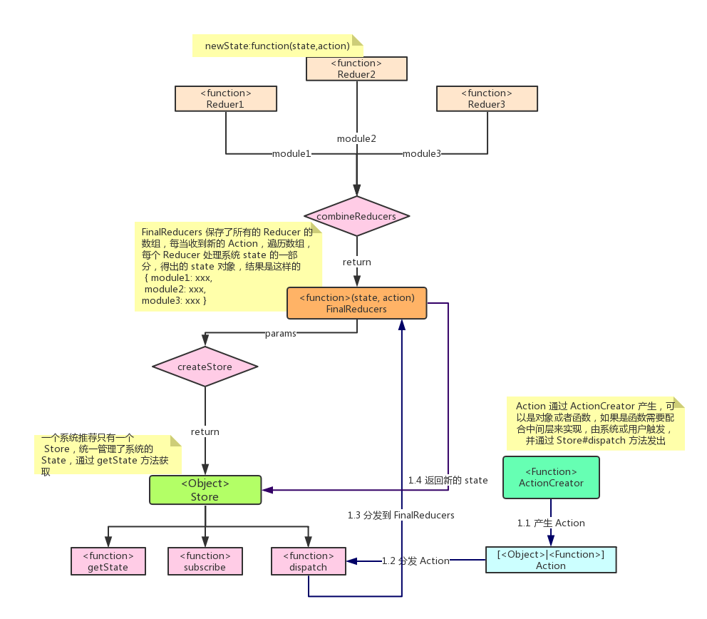
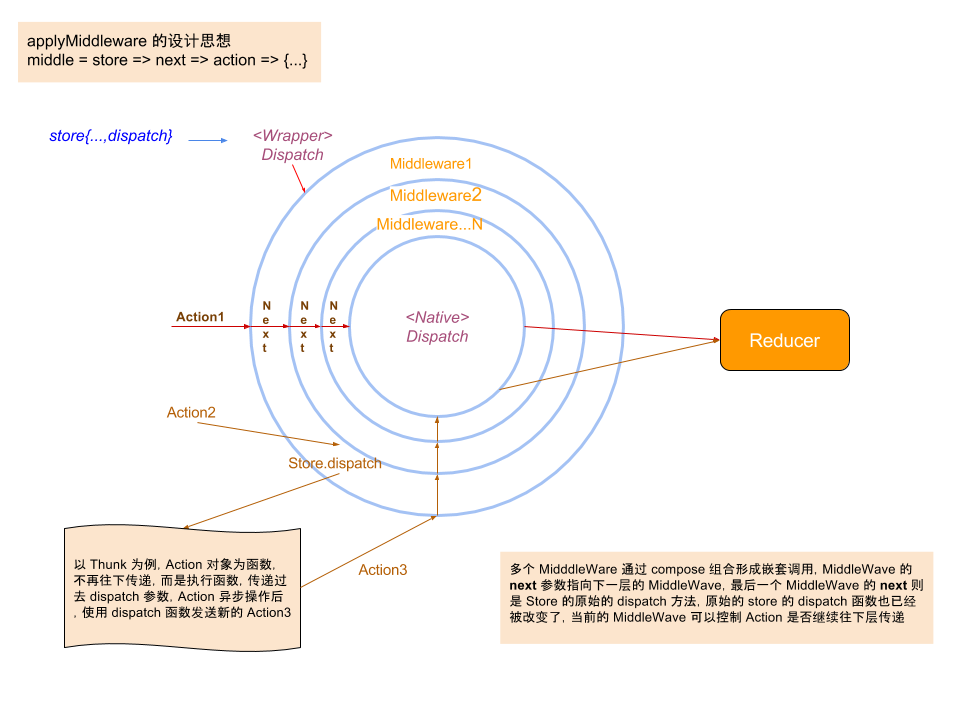

# 使用 Redux 进行 ReactNative 开发一

安装

`npm install --save redux`

一般还需要添加另外两个依赖

```
//和 React 绑定
npm install --save react-redux
//异步 Action
npm install --save redux-thunk
```

## 角色



### Action

Action 由 ActionCreator 生成，实际上只是个函数，而 Action 则是 JS 的一个普通对象（当需要使用异步分发的时候，可以返回函数），按照约定，需要有个一个 `type` 属性

```javascript
// action creator 就是函数而已...
var actionCreator = function() {
    // ...负责构建一个 action （是的，action creator 这个名字已经很明显了）并返回它
    return {
        type: 'AN_ACTION'
    }
}
```

### Reducer

接收应用程序的当前状态以及发生的 Action，然后返回修改后的新状态，一个 reducer 会得到这些参数 `(state, action)`，并且会在状态初始化的时候调用一次

```javascript

const updateTest = (state = "", action) => {

    switch (action.type) {
        case 'TEXT_UPDATE':
            //新的state , ES7 Object Spread
            return {
              state...,
              text: action.text};
        default:
            //返回原来的state
            return state
    }
}
```

通常情况下一个应用会有多个 Action，如果都写在一个 Reducer 模块中肯定是不合适的，所以允许有多个 Reducer 存在，而 `createStore` 只能接受一个 Reducer，所以可以使用 `combineReducers` 方法来合并多一个 Reducer

```javascript

import { combineReducers } from 'redux'

var reducer = combineReducers({
    user: userReducer,
    items: itemsReducer
})
```

这样每个 Reducer 只处理一部分 state

如果 `userReducer` 和 `itemsReducer` 的定义如下

```javascript
var userReducer = function (state = {}, action) {
    console.log('userReducer was called with state', state, 'and action', action)

    switch (action.type) {
        // etc.
        default:
            return state;
    }
}
var itemsReducer = function (state = [], action) {
    console.log('itemsReducer was called with state', state, 'and action', action)

    switch (action.type) {
        // etc.
        default:
            return state;
    }
}
```

如上，`userReducer` 处理的 state 是应用 Store 的 state 对象的 user 属性所指的对象，而 `itemsReducer` 处理的是数组类型的 state，如果这时候初始化 Store 并不指定初始状态，那么当前应用的 state 应该是 `{user : {}, items : []}`

### Store

有了 Action 和处理 Action 并更新 state 的 Reducer后，还需要一个角色来连接这两个对象，那就是 Store

Store 实例有以下方法：

- 提供 `getState()` 方法获取 `state`
- 提供 `dispatch(action)` 方法分发 Action 到 Reducer 更新 state
- 通过 `subscribe(listener)` 注册监听器
- 通过 `subscribe(listener)` 返回的函数注销监听器

通过 `createStore` 方法来创建 store，可以接受 Reducer 为参数，就可以分发 Action 到 Reducers

```javascript

import { createStore } from 'redux'  
let store = createStore(reducers);
//...
store.dispatch(action);
```

## Middleware 的原理



## 异步分发 Middleware

ActionCreator 一般返回的 Action 是一个对象，但我们使用 [redux-thunk](https://github.com/gaearon/redux-thunk) 这个中间件后，就可以返回一个函数

中间件是一个纯粹的函数，格式如下：

```javascript

var anyMiddleware = function ({ dispatch, getState }) {
    return function(next) {
        return function (action) {
          if (typeof action === 'function') {
            return action(dispatch, getState, extraArgument);
          }
          return next(action);
        }
    }
}
```

为了让 Redux 知道我们有一个或多个中间件，我们使用 Redux 的辅助函数 `applyMiddleware` 来修改我们获取 Store 的途径

使用

```javascript

export const asyncAction = (text) => {
    return function (dispatch) {
        console.log('asyncAction pre dispatch');
        setTimeout(function () {
            console.log('asyncAction dispatch');
            dispatch({type: 'ASYNC_ACTION', text: "this is an async " + text});
        }, 2000);
    }
}
```

```javascript
import {asyncAction} from ...
import { createStore, applyMiddleware } from 'redux'
import ReduxThunk from 'redux-thunk'

const finalCreateStore = applyMiddleware(ReduxThunk)(createStore);
const store = finalCreateStore(reducer);
//....分发一个异步 Action， ActionCreator 返回的是 函数
store.dispatch(asyncAction('Update By Redux'));
```

## 状态更新的监听

Store 提供的了 `subscribe` 方法可以用来监听状态的变化，注册参数为一个函数，不需要任何参数，返回一个取消注册的函数

```javascript
componentDidMount() {
    this.unsubscribe = this.store.subscribe(function (...args) {
        //没有参数的
        console.log('update:', args);
    });
}

componentWillUnmount() {
    //取消注册
    this.unsubscribe();
}
```

# 更多

- [Redux 中文文档](http://cn.redux.js.org/index.html)
- [解析 Redux 源码](https://zhuanlan.zhihu.com/p/22809799)
- [探究redux源码-衍生-中间件思想](https://github.com/sunyongjian/blog/issues/21)
