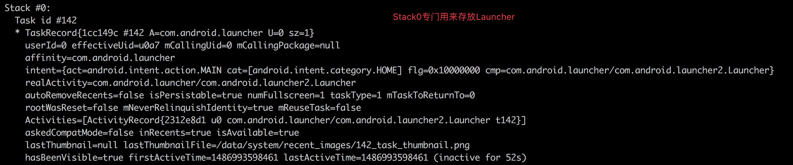
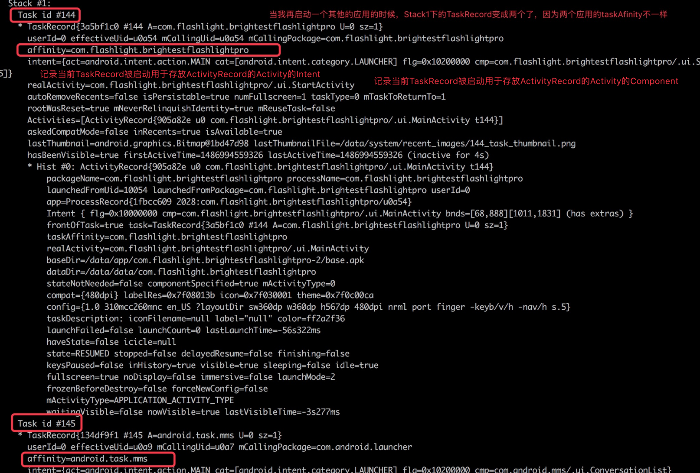

Ams管理了两种ActivityStack，mHomeStack（标识位0）和其他的Stack(理论上可以存在多个，但一般只有一个)

先来简单了解下ActivityStack的信息，输入下面命令，即可以查看当前系统的ActivityStack、TaskRecord、ActivityRecord的信息

```
adb shell dumpsys activity activities
```

只启动短信应用后的信息如下：




关闭信息，启动另外的一个应用，置于后台，再打开短信应用，再回到刚刚的应用后



# 栈的状态和调整的一些方法

`ActivityStack`的管理类是`ActivityStackSupervisor`

```java
// 根据mStackState 确定当前获取到焦点的Stack
ActivityStack getFocusedStack() {
    if (mFocusedStack == null) {
        return mHomeStack;
    }
    switch (mStackState) {
        case STACK_STATE_HOME_IN_FRONT:
        case STACK_STATE_HOME_TO_FRONT:
            return mHomeStack;
        case STACK_STATE_HOME_IN_BACK:
        case STACK_STATE_HOME_TO_BACK:
        default:
            return mFocusedStack;
    }
}
//
ActivityStack getLastStack() {
    switch (mStackState) {
        case STACK_STATE_HOME_IN_FRONT:
        case STACK_STATE_HOME_TO_BACK:
            return mHomeStack;
        case STACK_STATE_HOME_TO_FRONT:
        case STACK_STATE_HOME_IN_BACK:
        default:
            return mFocusedStack;
    }
}

//判断当前栈是否为前台显示的栈
boolean isFrontStack(ActivityStack stack) {
    //因为只分辨两种栈，HomeStack和其他，下面可以转换成如下更好理解
    //(stack.isHomeStack() && getFocusedStack().isHomeStack()) || (stack.isHomeStack()&&getFocusedStack().isHomeStack())
    return !(stack.isHomeStack() ^ getFocusedStack().isHomeStack());
}
//修改当前HOME Stack是否在前台
void moveHomeStack(boolean toFront) {
    final boolean homeInFront = isFrontStack(mHomeStack);
    // (homeInFront && !toFront)||(!homeInFront && toFront)
    if (homeInFront ^ toFront) {
        mStackState = homeInFront ? STACK_STATE_HOME_TO_BACK : STACK_STATE_HOME_TO_FRONT;
    }
}
```

当启动一个Activity的时候，会调用该方法，调整当前获取得焦点的栈

如果启动的是`APPLICATION_ACTIVITY_TYPE`类型，那么又细分几种情况：A、如果绑定了某个`ActivityStack`那么修改`mForceStack`并返回；B、如果没绑定，且`mFocusedStack`不为空，直接返回`mFocusedStack` C、遍历所有`ActivityStack`，找到非HOME类型的，记录并返回 D、调用`AMS.createStack()`创建一个并返回

```java
ActivityStack adjustStackFocus(ActivityRecord r) {
    final TaskRecord task = r.task;
    if (r.isApplicationActivity() || (task != null && task.isApplicationTask())) { //end 71
      //可以看出对于`ApplicationActivity`类型的`ActivityRecord`
        if (task != null) {
            final ActivityStack taskStack = task.stack;
            if (mFocusedStack != taskStack) {
                mFocusedStack = taskStack.isHomeStack() ? null : taskStack;
            }
            return taskStack;
        }

        if (mFocusedStack != null) {
            return mFocusedStack;
        }

        for (int stackNdx = mStacks.size() - 1; stackNdx > 0; --stackNdx) {
            ActivityStack stack = mStacks.get(stackNdx);
            if (!stack.isHomeStack()) {
                mFocusedStack = stack;
                return mFocusedStack;
            }
        }
        // Time to create the first app stack for this user.
        int stackId =  mService.createStack(-1, HOME_STACK_ID, StackBox.TASK_STACK_GOES_OVER, 1.0f);
        mFocusedStack = getStack(stackId);
        return mFocusedStack;
    }// end 71
    //对`HOME_ACTIVITY_TYPE`和`RECENTS_ACTIVITY_TYPE`类型ActivityRecord的才返回mHomeStack
    return mHomeStack;
}
```

`setFocusedStack`方法通过修改`mStackState`来影响`getFocusedStack`方法的返回值

```java
void setFocusedStack(ActivityRecord r) {
    if (r == null) {
        return;
    }
    if (!r.isApplicationActivity() || (r.task != null && !r.task.isApplicationTask())) {
        if (mStackState != STACK_STATE_HOME_IN_FRONT) {
            mStackState = STACK_STATE_HOME_TO_FRONT;
        }
    } else {
        final ActivityStack taskStack = r.task.stack;
        mFocusedStack = taskStack.isHomeStack() ? null : taskStack;
        mStackState = STACK_STATE_HOME_TO_BACK;
        }
    }
}
```

# Stack的创建

上一节说得，在启动Activity的时候，ASS会调整焦点栈，就可能调用到`AMS.createStack()`方法来创建一个新的`ActivityStack`

```java
//taskId=-1，relativeStackBoxId=HOME_STACK_ID=0 , position=6 , weight=1

ActivityManagerService.java
@Override
public int createStack(int taskId, int relativeStackBoxId, int position, float weight) {
    enforceCallingPermission(android.Manifest.permission.MANAGE_ACTIVITY_STACKS,"createStack()");
    synchronized (this) {
        long ident = Binder.clearCallingIdentity();
        try {
            int stackId = mStackSupervisor.createStack();
            mWindowManager.createStack(stackId, relativeStackBoxId, position, weight);
            if (taskId > 0) { //taskId=-1，还未绑定相应的额TaskRecord
                moveTaskToStack(taskId, stackId, true); //移动到特定的TaskRecord到特定的ActivityStack的顶端或底端
            }
            return stackId;
        } finally {
            Binder.restoreCallingIdentity(ident);
        }
    }
}
```

调用`ActivityStackSupervisor#createStack`

Stack Id的计算，`HOME_STACK_ID`为0，累加上去，找到最小的未分配的id值，如果分配了1，2，但是id为1的栈可能会置空了，就返回1

```java
ActivityStackSupervisor.java

int createStack() {
     while (true) {
         if (++mLastStackId <= HOME_STACK_ID) {
             mLastStackId = HOME_STACK_ID + 1;
         }
         if (getStack(mLastStackId) == null) {
             break;
         }
     }
     mStacks.add(new ActivityStack(mService, mContext, mLooper, mLastStackId)); //ActivityStack的新建
     return mLastStackId;
 }
```
