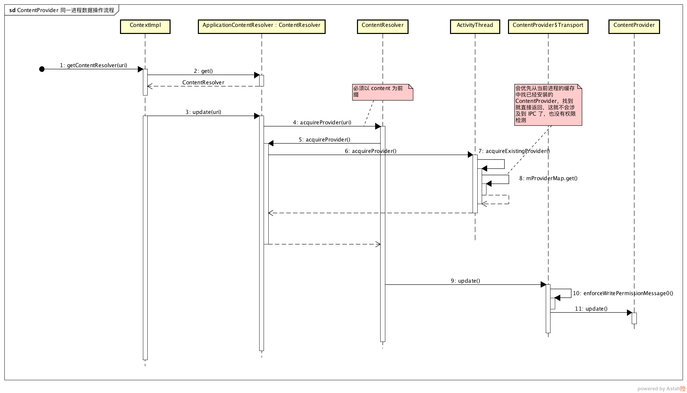
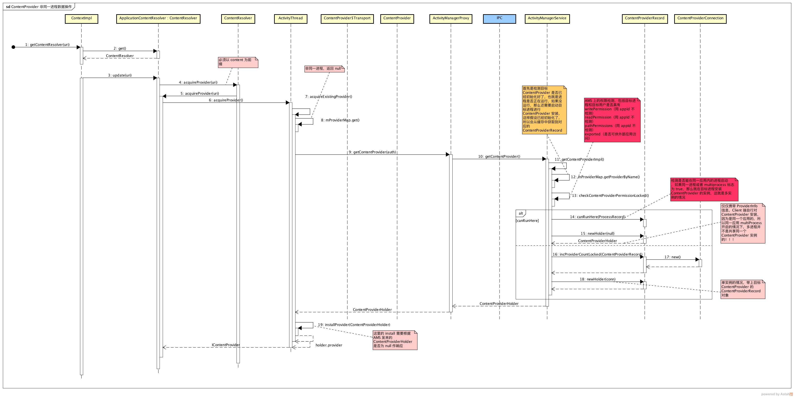

# ContentProvider 源码笔记

## 实现原理

## 初始化和发布

### 初始化

进程启动流程简述

客户端进程启动 -> `ActivityThread#main` -> `ActivityThread#attach` -> `ActivityManagerNative#attachApplication` -> `ActivitymanagerService#attachApplication`

在 `ActivitymanagerService#attachApplication` 方法中会调用到 `ActivitymanagerService#generateApplicationProvidersLocked` 这个方法，这个方法通过 `PKMS` 去获取解析后的应用的清单文件中 `provider` 信息，为每个 `provider` 新建 `ContentProviderRecord` 作为 `AMS` 端的 `ContentProvider` 表现


```java
ActivityManagerService.java

private final List<ProviderInfo> generateApplicationProvidersLocked(ProcessRecord app) {
    List<ProviderInfo> providers = null;
    providers = AppGlobals.getPackageManager().queryContentProviders(...);  //PKMS 获取清单中的 <providers/> 节点信息
    int userId = app.userId;
    if (providers != null) {
        int N = providers.size();
        app.pubProviders.ensureCapacity(N + app.pubProviders.size());
        for (int i=0; i<N; i++) {
            ProviderInfo cpi = (ProviderInfo)providers.get(i);
            // 带 flag：FLAG_SINGLE_USER，且需要有 android.Manifest.permission.INTERACT_ACROSS_USERS 权限
            boolean singleton = isSingleton(cpi.processName, cpi.applicationInfo, cpi.name, cpi.flags);
            if (singleton && UserHandle.getUserId(app.uid) != 0) {
                providers.remove(i);
                N--;
                i--;
                continue;
            }
            ComponentName comp = new ComponentName(cpi.packageName, cpi.name);
            ContentProviderRecord cpr = mProviderMap.getProviderByClass(comp, userId);
            if (cpr == null) {
                cpr = new ContentProviderRecord(this, cpi, app.info, comp, singleton);
                mProviderMap.putProviderByClass(comp, cpr);
            }
            app.pubProviders.put(cpi.name, cpr);
            if (!cpi.multiprocess || !"android".equals(cpi.packageName)) {
                app.addPackage(cpi.applicationInfo.packageName, mProcessStats);
            }
            //..
        }
    }
    return providers;
}
```

通过 `PKMS` 取到 `List<ProviderInfo>` 列表，最后会通过 IPC 机制传递回 `ActivityThread` 并在 `ActivityThread#handleBindApplication` 方法中进行安装，`PKMS` 解析出来的 `ProviderInfo` 信息如下


遍历 `provider` 列表，进行安装并通知 `AMS` 安装完毕

```java
private void installContentProviders( Context context, List<ProviderInfo> providers) {
    final ArrayList<IActivityManager.ContentProviderHolder> results = new ArrayList<IActivityManager.ContentProviderHolder>();
    for (ProviderInfo cpi : providers) {
        IActivityManager.ContentProviderHolder cph = installProvider(context, null, cpi, false /*noisy*/, true /*noReleaseNeeded*/, true /*stable*/);
        if (cph != null) {
            cph.noReleaseNeeded = true;
            results.add(cph);
        }
    }
    try {
        ActivityManagerNative.getDefault().publishContentProviders( getApplicationThread(), results);
    } catch (RemoteException ex) {
    }
}
```

具体安装在 `installProvider` 方法处理，安装过程会通过反射的方式来新建 `ContentProvider`，同时新建了一个实现 `IContentProvider` 接口和继承 `Binder` 的 `Transport` 类，**这个对象很重要**，作为 `binder` 本地对象提供服务，记录清单记录的权限信息接着调用 `ContentProvider#onCreate` 方法，后还需要在 `ActivityThread` 中以 `ProviderClientRecord` 对象作为表示并记录在 `ActivityThread`，建立了 `ContentProvider` 和 `ProviderClientRecord` 的联系

```java

private IActivityManager.ContentProviderHolder installProvider(Context context, IActivityManager.ContentProviderHolder holder, ProviderInfo info,
        boolean noisy, boolean noReleaseNeeded, boolean stable) {
    ContentProvider localProvider = null;
    IContentProvider provider;
    if (holder == null || holder.provider == null) {
        Context c = null;
        ApplicationInfo ai = info.applicationInfo;
        if (context.getPackageName().equals(ai.packageName)) {
            c = context;
        }
        //...
        try {
            final java.lang.ClassLoader cl = c.getClassLoader();
            localProvider = (ContentProvider)cl.loadClass(info.name).newInstance();
            provider = localProvider.getIContentProvider(); //Transport , Binder 本地对象
            //...
            localProvider.attachInfo(c, info);  //
        } catch (java.lang.Exception e) {
            //...
        }
    }
    //...
    IActivityManager.ContentProviderHolder retHolder;

    synchronized (mProviderMap) {
        //...
        IBinder jBinder = provider.asBinder();  //Transport , Binder 本地对象
        if (localProvider != null) {
            ComponentName cname = new ComponentName(info.packageName, info.name);
            ProviderClientRecord pr = mLocalProvidersByName.get(cname);
            if (pr != null) {
                //...
            } else {
                holder = new IActivityManager.ContentProviderHolder(info);  //ContentProviderHolder 对象会反馈到 AMS，记录了一个 ContentProvider 的 binder 对象，所以叫 holder 嘛
                holder.provider = provider;
                holder.noReleaseNeeded = true;
                pr = installProviderAuthoritiesLocked(provider, localProvider, holder);
                mLocalProviders.put(jBinder, pr);
                mLocalProvidersByName.put(cname, pr);
            }
            retHolder = pr.mHolder;
        } else {
            //...
        }
    }
    return retHolder;//ContentProviderHolder 对象会反馈到 AMS
}
```

### 正式注册到 AMS

之后还需要通知 `AMS` 服务端的 `ContentProvider` 已经安装完了，`IActivityManager.ContentProviderHolder` 作为和 `AMS` 联系的信息载体，`IActivityManager.ContentProviderHolder` 的新建的时候记录了 `ContentProvider#mTransport` 这个实现了 `IContentProvider` 接口的 `binder` 本地对象，最后调用了 `publishContentProviders` 方法发送到 `AMS`

前面已经说到 `AMS` 已经为 `ContentProvider` 建立了 `ContentProviderRecord` 对象并记录在其进程对象中，当客户端进程处理完 `ContentProvider` 的实例化等操作后，将接受到 `ContentProviderProxy` 这个代理对象，并记录在 `ContentProviderRecord#provider` 上，以便和目标进程的 `ContentProvider` 进行通信

```java

public final void publishContentProviders(IApplicationThread caller, List<ContentProviderHolder> providers) {

    synchronized (this) {
        final ProcessRecord r = getRecordForAppLocked(caller);
        //...
        final long origId = Binder.clearCallingIdentity();

        final int N = providers.size();
        for (int i=0; i<N; i++) {
            ContentProviderHolder src = providers.get(i);
            //..
            ContentProviderRecord dst = r.pubProviders.get(src.info.name);  //通过名字可以找到对应要绑定的 ContentProviderRecord
            //..
            if (dst != null) {
                ComponentName comp = new ComponentName(dst.info.packageName, dst.info.name);
                mProviderMap.putProviderByClass(comp, dst); //表明注册完毕，记录以供其他用户查询
                String names[] = dst.info.authority.split(";");
                for (int j = 0; j < names.length; j++) {
                    mProviderMap.putProviderByName(names[j], dst);  //表明注册完毕，记录以供其他用户查询
                }
                //...
                synchronized (dst) {
                    dst.provider = src.provider;  //这步很重要，建立了和具体 ContentProvider 联系
                    dst.proc = r;
                    dst.notifyAll();
                }
                //...
            }
        }
        //...
    }
}
```


这里出现了不少 `ContentProvider` 在不同场景的表现，其中最重要的是 `ContentProvider`、`ProviderClientRecord`、`ContentProviderRecord`，分别代表了 `ContentProvider` 的真实实例，`ContentProvider` 记录在 `ActivityThread` 缓存中的记录和在 `AMS` 中的记录，另外的 `ContentProviderHolder` 将作为服务/客户进程和 `AMS` 间的信息载体，详细描述和关系如下


## 数据处理操作

### 同一进程访问

对于同一进程对 `ContentProvider` 的访问比较简单，因为进程启动的时候已经对 `ContentProvider` 进行了安装并初始化，所以可以在 `ActivityThread` 中直接找到缓存的 `IContentProvider`，直接操作



### 同一应用非同一进程访问



#### 单实例还是多实例？

对于同一应用的非同一进程访问需要通过 `AMS` 来找到目标的 `IContentProvider` 对象并进行通讯，如果目标的进程还未启动，那么还需要先把目标进程启动，过程就有点繁琐了，所以这里直接假设目标进程已经启动的情况，所以会找到目标的 `ContentProviderRecord` 对象，其中 `cpr.canRunHere` 的判断决定了是否单实例的情况

- 1、检测是否能在同一应用内的进程启动，如果同一进程或者 `multiprocess` 标志为 `true`，那么就在目标进程安装 `ContentProvider` 的实例，这就是多实例的情况，这时候只需要向目标进程发送目标 `ContentProvider` 的 `ProviderInfo` 信息即可，剩下就是目标进程的安装过程

- 2、单实例的情况，带上目标 `ContentProvider` 的 `ContentProviderRecord` 对象

```java

private final ContentProviderHolder getContentProviderImpl(IApplicationThread caller,String name, IBinder token, boolean stable, int userId) {
    ContentProviderRecord cpr;
    ContentProviderConnection conn = null;
    ProviderInfo cpi = null;

    synchronized(this) {
        ProcessRecord r = null;
        if (caller != null) {
            r = getRecordForAppLocked(caller);  //目标进程
            //...
        }

        // 检测目标 ContentProvider 是否存在
        cpr = mProviderMap.getProviderByName(name, userId);
        boolean providerRunning = cpr != null;
        if (providerRunning) {
            cpi = cpr.info;
            String msg;
            //权限检测
            if ((msg=checkContentProviderPermissionLocked(cpi, r)) != null) {
                throw new SecurityException(msg);
            }

            if (r != null && cpr.canRunHere(r)) {
                // multiprocess 为 ture，支持应用内多进程，所以 ContentProvider 需要在目标进程实例化
                ContentProviderHolder holder = cpr.newHolder(null);
                holder.provider = null;
                return holder;
            }

            final long origId = Binder.clearCallingIdentity();

            // 单实例的情况
            conn = incProviderCountLocked(r, cpr, token, stable);
            //...
        }
        //...
    }//synchronized
    // Wait for the provider to be published...
    synchronized (cpr) {
        while (cpr.provider == null) {
          //...
        }
    }
    return cpr != null ? cpr.newHolder(conn) : null;
}
```

#### 客户端的安装

主要是根据 `AMS` 发来的 `ContentProviderHolder` 是否为 `null` 作响应，如果为 `null` ，那么和进程启动并安装 `ContentProvider` 的流程一样，所以直接看非空的情况，客户端收到的将是一个 `ContentProviderProxy` 代理对象，将用来和目标 `ContentProvider` 进行通信

```java

private IActivityManager.ContentProviderHolder installProvider(Context context, IActivityManager.ContentProviderHolder holder, ProviderInfo info,
        boolean noisy, boolean noReleaseNeeded, boolean stable) {
    ContentProvider localProvider = null;
    IContentProvider provider;
    if (holder == null || holder.provider == null) {
        //
    } else {
        //
        provider = holder.provider; //AMS 发来的，这里会是一个 ContentProviderProxy 对象
    }

    IActivityManager.ContentProviderHolder retHolder;

    synchronized (mProviderMap) {
        //...
        IBinder jBinder = provider.asBinder();
        if (localProvider != null) {
          //..
        } else {
            ProviderRefCount prc = mProviderRefCountMap.get(jBinder);
            if (prc != null) {
                //..
                // We need to transfer our new reference to the existing
                // ref count, releasing the old one...  but only if
                // release is needed (that is, it is not running in the
                // system process).
                if (!noReleaseNeeded) {
                    incProviderRefLocked(prc, stable);
                    try {
                        ActivityManagerNative.getDefault().removeContentProvider( holder.connection, stable);
                    } catch (RemoteException e) {
                        //do nothing content provider object is dead any way
                    }
                }
            } else {
                //本地进程缓存记录
                ProviderClientRecord client = installProviderAuthoritiesLocked( provider, localProvider, holder);
                if (noReleaseNeeded) {
                    prc = new ProviderRefCount(holder, client, 1000, 1000);
                } else {
                    prc = stable ? new ProviderRefCount(holder, client, 1, 0) : new ProviderRefCount(holder, client, 0, 1);
                }
                mProviderRefCountMap.put(jBinder, prc);
            }
            retHolder = prc.holder;
        }
    }

    return retHolder;
}
```

### 权限检测

`ContentProvider` 可以通过以下标志进行权限限制

- `android:permission` : 外部应用访问所需要的读取/写入权限
- `android:readPermission` : 外部应用访问需要的读取权限
- `android:writePermission` : 外部应用访问需要的写入权限
- `android:exported` : 是否允许外部应用访问

如若需要提供给外部应用访问，那么 `exported` 为 `true`，此时需要我们定义外部应用需要的访问权限，定义使用 `<permission/>` 来定义，此时需要认真的考虑 `protectionLevel`，一般的话一个公司打包签名 APP 的签名证书都应该是一致的，这种情况下，Provider 的 `android:protectionLevel` 应为设为 `signature` 比较合适

#### AMS 端的检测

`AMS` 对应用请求的 `ContentProvider` 使用前会先进行权限检测，包括 `writePermission`（同 `appId` 不检测）、`readPermission`（同 `appId` 不检测）、`pathPermissions`（同 `appId` 不检测）、`exported`（是否可供外部应用访问）、必要的时候还要用 `PKMS#checkUidPermission` 方法进行权限检测

```java
private final String checkContentProviderPermissionLocked(ProviderInfo cpi, ProcessRecord r) {
    final int callingPid = (r != null) ? r.pid : Binder.getCallingPid();  //同一应用，可以多个 PID
    final int callingUid = (r != null) ? r.uid : Binder.getCallingUid();  //同一应用，只有一个 uid
    if (checkComponentPermission(cpi.readPermission, callingPid, callingUid, cpi.applicationInfo.uid, cpi.exported)
            == PackageManager.PERMISSION_GRANTED) {
        return null;
    }
    if (checkComponentPermission(cpi.writePermission, callingPid, callingUid, cpi.applicationInfo.uid, cpi.exported)
            == PackageManager.PERMISSION_GRANTED) {
        return null;
    }

    PathPermission[] pps = cpi.pathPermissions;
    if (pps != null) {
        int i = pps.length;
        while (i > 0) {
            i--;
            PathPermission pp = pps[i];
            if (checkComponentPermission(pp.getReadPermission(), callingPid, callingUid, cpi.applicationInfo.uid, cpi.exported)
                    == PackageManager.PERMISSION_GRANTED) {
                return null;
            }
            if (checkComponentPermission(pp.getWritePermission(), callingPid, callingUid, cpi.applicationInfo.uid, cpi.exported)
                    == PackageManager.PERMISSION_GRANTED) {
                return null;
            }
        }
    }

    ArrayMap<Uri, UriPermission> perms = mGrantedUriPermissions.get(callingUid);
    if (perms != null) {
        for (Map.Entry<Uri, UriPermission> uri : perms.entrySet()) {
            if (uri.getKey().getAuthority().equals(cpi.authority)) {
                return null;
            }
        }
    }
    String msg;
    if (!cpi.exported) {
        msg = "Permission Denial: opening provider "...
    } else {
        msg = "Permission Denial: opening provider " ...
    }
    Slog.w(TAG, msg);
    return msg;
}
```

```java
ActivityManager.java

//没个应用分配一个 uid，一个应用可能有多个进程，就拥有不同的 pid，但是其应用内进程共享同一个 uid
public static int checkComponentPermission(String permission, int uid, int owningUid, boolean exported) {
    // 系统服务和 root 用户，直接授权
    if (uid == 0 || uid == Process.SYSTEM_UID) {
        return PackageManager.PERMISSION_GRANTED;
    }
    // Isolated processes don't get any permissions.
    if (UserHandle.isIsolated(uid)) {
        return PackageManager.PERMISSION_DENIED;
    }
    // 同一个应用，不需要检测
    if (owningUid >= 0 && UserHandle.isSameApp(uid, owningUid)) {
        return PackageManager.PERMISSION_GRANTED;
    }
    // If the target is not exported, then nobody else can get to it.
    if (!exported) {
        return PackageManager.PERMISSION_DENIED;
    }
    if (permission == null) {
        return PackageManager.PERMISSION_GRANTED;
    }
    try {
        return AppGlobals.getPackageManager().checkUidPermission(permission, uid);
    } catch (RemoteException e) {
        Slog.e(TAG, "PackageManager is dead?!?", e);
    }
    return PackageManager.PERMISSION_DENIED;
}
```

#### ContentProvider 端的检测

目标 `ContentProvider` 被访问的时候每次也需要再进行权限检测，主要在 `Transport` 作为 `ContentProvider` 的代理类，其 `enforceXXXPermission` 等方法用来进行权限检测，这里的检测内容其实和 `AMS` 类似的

检测的内容：

```java
ContentProvider$Transport.java

private int enforceReadPermission(String callingPkg, Uri uri) throws SecurityException {
    enforceReadPermissionInner(uri);  //在 ContentProvider 中实现
    if (mReadOp != AppOpsManager.OP_NONE) { //默认不走 if 的逻辑
        return mAppOpsManager.noteOp(mReadOp, Binder.getCallingUid(), callingPkg);
    }
    return AppOpsManager.MODE_ALLOWED;
}
```

```java
ContentProvider.java

protected void enforceReadPermissionInner(Uri uri) throws SecurityException {
     final Context context = getContext();
     final int pid = Binder.getCallingPid();
     final int uid = Binder.getCallingUid();
     String missingPerm = null;

     if (UserHandle.isSameApp(uid, mMyUid)) { //是否同一应用
         return;
     }

     if (mExported) { //是否提供给其他进程使用
         final String componentPerm = getReadPermission();  
         if (componentPerm != null) {
             if (context.checkPermission(componentPerm, pid, uid) == PERMISSION_GRANTED) {  // 向 ams 查询目标应用是否具有权限，还是会走到 `ActivityManager.checkComponentPermission` 这个方法
                 return;
             } else {
                 missingPerm = componentPerm;
             }
         }
         // track if unprotected read is allowed; any denied
         // <path-permission> below removes this ability
         boolean allowDefaultRead = (componentPerm == null);

         final PathPermission[] pps = getPathPermissions();
         if (pps != null) {
             final String path = uri.getPath();
             for (PathPermission pp : pps) {
                 final String pathPerm = pp.getReadPermission();
                 if (pathPerm != null && pp.match(path)) {
                     if (context.checkPermission(pathPerm, pid, uid) == PERMISSION_GRANTED) {
                         return;
                     } else {
                         // any denied <path-permission> means we lose
                         // default <provider> access.
                         allowDefaultRead = false;
                         missingPerm = pathPerm;
                     }
                 }
             }
         }

         // if we passed <path-permission> checks above, and no default
         // <provider> permission, then allow access.
         if (allowDefaultRead) return;
     }

     // last chance, check against any uri grants
     if (context.checkUriPermission(uri, pid, uid, Intent.FLAG_GRANT_READ_URI_PERMISSION) == PERMISSION_GRANTED) {
         return;
     }

     final String failReason = mExported
             ? " requires " + missingPerm + ", or grantUriPermission()"
             : " requires the provider be exported, or grantUriPermission()";
             //...
 }
```

关于 `ContentProvider` 的安全问题，请阅读 [Android安全开发之Provider组件安全-阿里聚安全](https://jaq.alibaba.com/community/art/show?spm=a313e.7916648.0.0.3ne3Nh&articleid=352) 和 [创建 ContentProvider](https://developer.android.com/guide/topics/providers/content-provider-creating.html#Permissions)

## 小结

上面的过程可以简述为目标进程启动的时候新建 `ContentProvider` 实例并注册到 `AMS`，`AMS` 将保留了提供服务的 `ContentProvider` 的代理对象 `ContentProviderProxy`，当其他进程需要获取目标 `ContentProvider` 服务的时候，`AMS` 进行权限的检测并在内部找到该代理对象并发送到 Client 进程，所以 Client 也获得了提供服务的 `ContentProvider` 的代理对象，然后用这个代理对象就可以和服务进程的 `ContentProvider` 进行通信，之后不再需要经过 `AMS` 这一层，所以服务进程的 `ContentProvider` 也需要在每次数据操作之前进行权限检测


