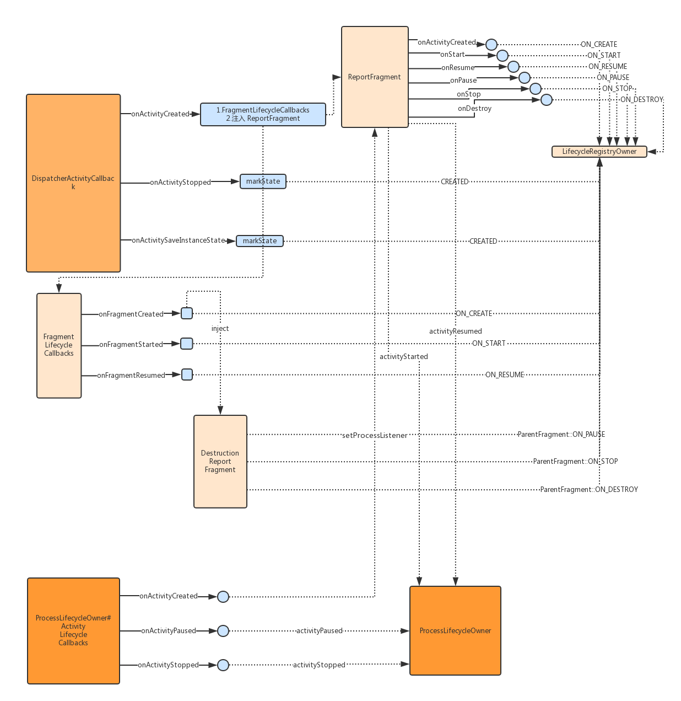

# Lifecycle 源码笔记

> 基于 `26.1.0`

入口 `LifecycleRuntimeTrojanProvider`

```java
public class LifecycleRuntimeTrojanProvider extends ContentProvider {
    @Override
    public boolean onCreate() {
        LifecycleDispatcher.init(getContext());
        ProcessLifecycleOwner.init(getContext());
        return true;
    }
//...
}
```

## LifecycleDispatcher 初始化

`LifecycleDispatcher` 从名字来看就是进行生命周期的回调，一般能想到的是通过 `ActivityLifecycleCallbacks` 或者 `Headless Fragment`

```java
class LifecycleDispatcher {

    private static final String REPORT_FRAGMENT_TAG = "android.arch.lifecycle"
            + ".LifecycleDispatcher.report_fragment_tag";

    private static AtomicBoolean sInitialized = new AtomicBoolean(false);

    static void init(Context context) {
        if (sInitialized.getAndSet(true)) {
            return;
        }
        ((Application) context.getApplicationContext()).registerActivityLifecycleCallbacks(new DispatcherActivityCallback());
    }

    //...
    private static void markState(FragmentManager manager, State state) {
        Collection<Fragment> fragments = manager.getFragments();
        if (fragments == null) {
            return;
        }
        for (Fragment fragment : fragments) {
            if (fragment == null) {
                continue;
            }
            markStateIn(fragment, state);
            if (fragment.isAdded()) {
                markState(fragment.getChildFragmentManager(), state);
            }
        }
    }

    private static void markStateIn(Object object, State state) {
        if (object instanceof LifecycleRegistryOwner) {
            LifecycleRegistry registry = ((LifecycleRegistryOwner) object).getLifecycle();
            registry.markState(state);
        }
    }

    private static void markState(FragmentActivity activity, State state) {
        markStateIn(activity, state);
        markState(activity.getSupportFragmentManager(), state);
    }

    private static void dispatchIfLifecycleOwner(Fragment fragment, Lifecycle.Event event) {
        if (fragment instanceof LifecycleRegistryOwner) {
            ((LifecycleRegistryOwner) fragment).getLifecycle().handleLifecycleEvent(event);
        }
    }
    //...
  }
```

注册了一个 `ActivityLifecycleCallbacks` 可以监听 `Activity` 的生命周期,并在 `Activity#onCreate` 的时候做了一些能够监听内部 Fragment 生命周期回调的操作

1.对于使用 v4 包中的 `FragmentActivity`，使用的 `FragmentLifecycleCallbacks` 来监听 `Fragment` 状态还注入了一个 `ReportFragment`，类型 `android.app.Fragment`

2.对于使用 SDK 自带的 `FragmentActivity`，只注入一个 `android.app.Fragment` 类型的 `Headless Fragment`，即 `ReportFragment`

仅在 `Activity#onStop` 和 `Activity#onSaveInstanceState` 的时候还要把状态设置成 `CREATED`，会分发到该 Activity 和内部的所有 `android.support.v4.app.Fragment` 中实现了 `LifecycleRegistryOwner` 的实例，而 `LifecycleRegistryOwner` 是用来管理内部多个 `Lifecycle`

```java
static class DispatcherActivityCallback extends EmptyActivityLifecycleCallbacks {
    private final FragmentCallback mFragmentCallback;

    DispatcherActivityCallback() {
        mFragmentCallback = new FragmentCallback();
    }

    @Override
    public void onActivityCreated(Activity activity, Bundle savedInstanceState) {
        if (activity instanceof FragmentActivity) {
            //This class requires API level 25.1.0 or higher
            ((FragmentActivity) activity).getSupportFragmentManager()
                    .registerFragmentLifecycleCallbacks(mFragmentCallback, true);
        }
        ReportFragment.injectIfNeededIn(activity);  //注入一个 Headless Fragment
    }

    @Override
    public void onActivityStopped(Activity activity) {
        if (activity instanceof FragmentActivity) {
            markState((FragmentActivity) activity, CREATED);
        }
    }

    @Override
    public void onActivitySaveInstanceState(Activity activity, Bundle outState) {
        if (activity instanceof FragmentActivity) {
            markState((FragmentActivity) activity, CREATED);
        }
    }
}
```

- ReportFragment

  `ReportFragment` 生命周期会回调到宿主 `LifecycleRegistry`，另外在 `Fragment#onCrate`、`Fragment#onStart` 和 `Fragment#onResume` 有一个 `ActivityInitializationListener` 接口的回调

  ```java
  public class ReportFragment extends Fragment {
      private static final String REPORT_FRAGMENT_TAG = "android.arch.lifecycle.LifecycleDispatcher.report_fragment_tag";

      public static void injectIfNeededIn(Activity activity) {
          // ProcessLifecycleOwner should always correctly work and some activities may not extend
          // FragmentActivity from support lib, so we use framework fragments for activities
          android.app.FragmentManager manager = activity.getFragmentManager();
          if (manager.findFragmentByTag(REPORT_FRAGMENT_TAG) == null) {
              manager.beginTransaction().add(new ReportFragment(), REPORT_FRAGMENT_TAG).commit();
              // Hopefully, we are the first to make a transaction.
              manager.executePendingTransactions();
          }
      }

      static ReportFragment get(Activity activity) {
          return (ReportFragment) activity.getFragmentManager().findFragmentByTag(REPORT_FRAGMENT_TAG);
      }

      private ActivityInitializationListener mProcessListener;

      private void dispatchCreate(ActivityInitializationListener listener) {
          if (listener != null) {
              listener.onCreate();
          }
      }

      private void dispatchStart(ActivityInitializationListener listener) {
          if (listener != null) {
              listener.onStart();
          }
      }

      private void dispatchResume(ActivityInitializationListener listener) {
          if (listener != null) {
              listener.onResume();
          }
      }

      @Override
      public void onActivityCreated(Bundle savedInstanceState) {
          super.onActivityCreated(savedInstanceState);
          dispatchCreate(mProcessListener);
          dispatch(Lifecycle.Event.ON_CREATE);
      }

      @Override
      public void onStart() {
          super.onStart();
          dispatchStart(mProcessListener);
          dispatch(Lifecycle.Event.ON_START);
      }

      @Override
      public void onResume() {
          super.onResume();
          dispatchResume(mProcessListener);
          dispatch(Lifecycle.Event.ON_RESUME);
      }

      @Override
      public void onPause() {
          super.onPause();
          dispatch(Lifecycle.Event.ON_PAUSE);
      }

      @Override
      public void onStop() {
          super.onStop();
          dispatch(Lifecycle.Event.ON_STOP);
      }

      @Override
      public void onDestroy() {
          super.onDestroy();
          dispatch(Lifecycle.Event.ON_DESTROY);
          // just want to be sure that we won't leak reference to an activity
          mProcessListener = null;
      }

      private void dispatch(Lifecycle.Event event) {
          Activity activity = getActivity();
          if (activity instanceof LifecycleRegistryOwner) {
              ((LifecycleRegistryOwner) activity).getLifecycle().handleLifecycleEvent(event);
              return;
          }

          if (activity instanceof LifecycleOwner) {
              Lifecycle lifecycle = ((LifecycleOwner) activity).getLifecycle();
              if (lifecycle instanceof LifecycleRegistry) {
                  ((LifecycleRegistry) lifecycle).handleLifecycleEvent(event);
              }
          }
      }

      void setProcessListener(ActivityInitializationListener processListener) {
          mProcessListener = processListener;
      }

      interface ActivityInitializationListener {
          void onCreate();

          void onStart();

          void onResume();
      }
  }
  ```

- FragmentLifecycleCallbacks（使用了 support 包的 `FragmentActivity`）

  在 `v4.app.Fragment#onCrate`、`v4.app.Fragment#onStart` 和 `v4.app.Fragment#onResume` 回调 `ON_CREATE`、`ON_START` 和 `ON_RESUME`，另外如果当前 `v4.app.Fragment` 继承了 `LifecycleRegistryOwner`，还会往注入一个子 `Fragment`，`DestructionReportFragment`

  ```java
  static class FragmentCallback extends FragmentManager.FragmentLifecycleCallbacks {

    @Override
    public void onFragmentCreated(FragmentManager fm, Fragment f, Bundle savedInstanceState) {
        dispatchIfLifecycleOwner(f, ON_CREATE);
        if (!(f instanceof LifecycleRegistryOwner)) {
            return;
        }
        if (f.getChildFragmentManager().findFragmentByTag(REPORT_FRAGMENT_TAG) == null) {
            f.getChildFragmentManager().beginTransaction().add(new DestructionReportFragment(), REPORT_FRAGMENT_TAG).commit();
        }
    }

    @Override
    public void onFragmentStarted(FragmentManager fm, Fragment f) {
        dispatchIfLifecycleOwner(f, ON_START);
    }

    @Override
    public void onFragmentResumed(FragmentManager fm, Fragment f) {
        dispatchIfLifecycleOwner(f, ON_RESUME);
    }
  }
  ```

  `DestructionReportFragment` 负责在 `onPause`、`onStop` 和 `onDestroy` 的时候回调 `ON_PAUSE`、`ON_STOP` 和 `ON_DESTROY`

  ```java

  public static class DestructionReportFragment extends Fragment {
    @Override
    public void onPause() {
        super.onPause();
        dispatch(ON_PAUSE);
    }

    @Override
    public void onStop() {
        super.onStop();
        dispatch(ON_STOP);
    }

    @Override
    public void onDestroy() {
        super.onDestroy();
        dispatch(ON_DESTROY);
    }

    protected void dispatch(Lifecycle.Event event) {
        dispatchIfLifecycleOwner(getParentFragment(), event);
    }
  }
  ```

  **上面说了一大堆主要是了解怎么监听什么周期，并在什么时候进行什么周期回调和改变状态**

  

## ProcessLifecycleOwner

根据注释，`ProcessLifecycleOwner` 是为整个进程提供 `Lifecycle` 的，所以实现了 `LifecycleOwner`。`LifecycleDispatcher` 初始化的时候注入过一个 `android.app.Fragment` 类型的 `ReportFragment`，这里初始化的时候的时候也添加了一个 `ActivityLifecycleCallbacks`，并在 `Activity#onCreate` 的时候找到 `ReportFragment` 并添加 `ActivityInitializationListener`

```java

public class ProcessLifecycleOwner implements LifecycleOwner {

    @VisibleForTesting
    static final long TIMEOUT_MS = 700; //mls

    // ground truth counters
    private int mStartedCounter = 0;
    private int mResumedCounter = 0;

    private boolean mPauseSent = true;
    private boolean mStopSent = true;

    private Handler mHandler;
    private final LifecycleRegistry mRegistry = new LifecycleRegistry(this);

    private Runnable mDelayedPauseRunnable = new Runnable() {
        @Override
        public void run() {
            dispatchPauseIfNeeded();
            dispatchStopIfNeeded();
        }
    };

    private ActivityInitializationListener mInitializationListener = new ActivityInitializationListener() {
                @Override
                public void onCreate() {
                }

                @Override
                public void onStart() {
                    activityStarted();
                }

                @Override
                public void onResume() {
                    activityResumed();
                }
            };

    private static final ProcessLifecycleOwner sInstance = new ProcessLifecycleOwner();


    static void init(Context context) {
        sInstance.attach(context);
    }

    void activityStarted() {
        mStartedCounter++;
        if (mStartedCounter == 1 && mStopSent) {
            mRegistry.handleLifecycleEvent(Lifecycle.Event.ON_START);
            mStopSent = false;
        }
    }

    void activityResumed() {
        mResumedCounter++;
        if (mResumedCounter == 1) {
            if (mPauseSent) {
                mRegistry.handleLifecycleEvent(Lifecycle.Event.ON_RESUME);
                mPauseSent = false;
            } else {
                mHandler.removeCallbacks(mDelayedPauseRunnable);
            }
        }
    }

    void activityPaused() {
        mResumedCounter--;
        if (mResumedCounter == 0) {
            mHandler.postDelayed(mDelayedPauseRunnable, TIMEOUT_MS);
        }
    }

    void activityStopped() {
        mStartedCounter--;
        dispatchStopIfNeeded();
    }

    private void dispatchPauseIfNeeded() {
        if (mResumedCounter == 0) {
            mPauseSent = true;
            mRegistry.handleLifecycleEvent(Lifecycle.Event.ON_PAUSE);
        }
    }

    private void dispatchStopIfNeeded() {
        if (mStartedCounter == 0 && mPauseSent) {
            mRegistry.handleLifecycleEvent(Lifecycle.Event.ON_STOP);
            mStopSent = true;
        }
    }

    private ProcessLifecycleOwner() {
    }

    void attach(Context context) {
        mHandler = new Handler();
        mRegistry.handleLifecycleEvent(Lifecycle.Event.ON_CREATE);
        Application app = (Application) context.getApplicationContext();
        app.registerActivityLifecycleCallbacks(new EmptyActivityLifecycleCallbacks() {
            @Override
            public void onActivityCreated(Activity activity, Bundle savedInstanceState) {
                //前面  LifecycleDispatcher.init(getContext()) 的时候已经添加过 ReportFragment
                ReportFragment.get(activity).setProcessListener(mInitializationListener);
            }

            @Override
            public void onActivityPaused(Activity activity) {
                activityPaused();
            }

            @Override
            public void onActivityStopped(Activity activity) {
                activityStopped();
            }
        });
    }

    @Override
    public Lifecycle getLifecycle() {
        return mRegistry;
    }
```
