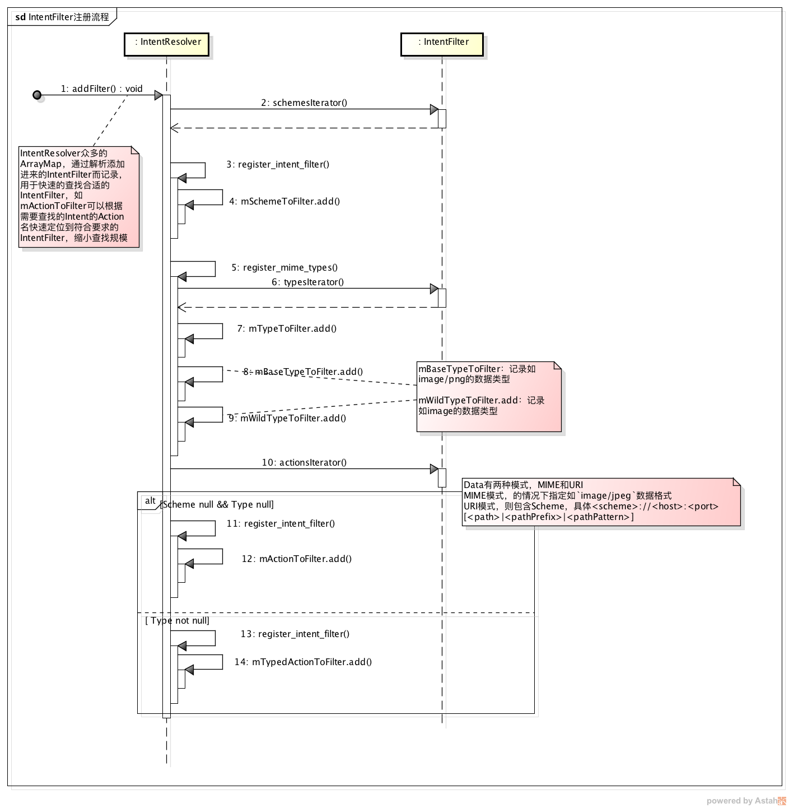

# Intent匹配规则

在`AMS`处理发送过来的广播（`Intent`）的时候，需要匹配`Intent`找到匹配的`Receiver`，另外的使用场景还有`Pms`对于4大组件中除了`ContentProvider`的查找都需要通过`Intent`匹配来查找，因为这3个主组都可以配置`IntentFilter`，`IntentFilter`作为过滤器，记录的是符合自己要求的Intent的信息，如`Action`，`Scheme`，`MIME`等，一般配合`IntentResolver`这个抽象类来使用，`IntentResolver`有众多的`ArrayMap<String, F[]>`，通过解析注册进来的`IntentFilter`信息保存记录其特定类型的配对关系，如`actionName -> IntentFilter[]`，用于快速的查找合适的`IntentFilter`，如`mActionToFilter`可以根据需要查找的`Intent`的`Action`名快速定位到符合要求的`IntentFilter`，缩小查找规模

## `IntentFilter`配置

```java
<intent-filter>
    <action android:name="android.intent.action.VIEW" />

    <category android:name="android.intent.category.DEFAULT" />

    <data android:mimeType="image/jpeg ">

    <data android:mimeType="video/* ">

    <data android:scheme="something" />

   <data android:host="project.example.com" />
</intent-filter>
```

**需要匹配大小写**

### Action

`IntentFilter`可以设置多个`<action/>`标签，但需要注意的是，`Intent`对象只能有一个`Action`

### Category

`IntentFilter`同样可以设置多个`<category/>`标签，`Intent`对象也可以设置多个`category`

### Data

#### 语法：

```java
<data android:scheme="string"
      android:host="string"
      android:port="string"
      android:path="string"
      android:pathPattern="string"
      android:pathPrefix="string"
      android:mimeType="string" />
```

`Data`稍微有点复杂，有两种模式，`MIME`和`URI`。`MIME`指媒体类型，如`image/jpeg`，可以表示图片、文本、视频等不同的媒体格式，而`URI`中包含的数据比较多了，下面是`URI`的结构：

> `<scheme>://<host>:<port>[<path>|<pathPrefix>|<pathPattern>]`

#### Scheme

`URI`的模式，如`http`,注意而不是`http:`

#### host

`URI`的主机，如果没有`Scheme`,那么就没意义的

#### port

`URI`的端口，如果没有`Scheme`和`host`，那么就没意义

#### path,pathPrefix,pathPattern

必须以`/`开头。`path`和`pathPattern`都表示完整路径，`pathPattern`可以包含通配符`*`，`.*`，分别代表0个或者多个字符和0到多个字符的任意序列，`pathPrefix`表示路径的前缀信息。

```java
//记录了所有注册的MIME类型，如"image/jpeg","image/*", or "{@literal *}/*"
mTypeToFilter = new ArrayMap<String, F[]>();

//记录全限定符的MIME类型，如"image"或者"*"，如果是"image/*"，则不会记录在这里
mBaseTypeToFilter = new ArrayMap<String, F[]>();

//记录了MIME子类型是通配符基本名称，如"image/*"，会记录饿"image"，但如果是"image/jpeg"就不会记录在这里，对于"{@literal *}/*"会记录`*`
mWildTypeToFilter = new ArrayMap<String, F[]>();
```

## IntentFilter注册过程



## 匹配代码

先初略过滤部分数据，再详细比较

```java
IntentResolver.java
//defaultOnly:false
  public List<R> queryIntent(Intent intent, String resolvedType, boolean defaultOnly,
          int userId) {
      String scheme = intent.getScheme();
      ArrayList<R> finalList = new ArrayList<R>();
      //协助用来过滤部分结果
      F[] firstTypeCut = null;
      F[] secondTypeCut = null;
      F[] thirdTypeCut = null;
      F[] schemeCut = null;

      if (resolvedType != null) {
          //指定数据类型，如image/jpeg
          int slashpos = resolvedType.indexOf('/');
          if (slashpos > 0) {
              final String baseType = resolvedType.substring(0, slashpos);
              //如果第是*/jpeg，那么就可以匹配任意的类型，所以直接跳去匹配Action
              if (!baseType.equals("*")) {
                  if (resolvedType.length() != slashpos+2|| resolvedType.charAt(slashpos+1) != '*') {
                      // 匹配类似image/jpeg的data类型，则resolvedType为image/jpeg，baseType为image
                      firstTypeCut = mTypeToFilter.get(resolvedType);
                      secondTypeCut = mWildTypeToFilter.get(baseType);
                  } else {
                      // 匹配子类类型为通配符的MIME类型.类似image/*.baseType为image
                      firstTypeCut = mBaseTypeToFilter.get(baseType);
                      secondTypeCut = mWildTypeToFilter.get(baseType);
                  }
                  // Any */* types always apply, but we only need to do this
                  // if the intent type was not already */*.
                  thirdTypeCut = mWildTypeToFilter.get("*");
              } else if (intent.getAction() != null) {
                  // The intent specified any type ({@literal *}/*).  This
                  // can be a whole heck of a lot of things, so as a first
                  // cut let's use the action instead.
                  firstTypeCut = mTypedActionToFilter.get(intent.getAction());
              }
          }
      }

      if (scheme != null) {
          schemeCut = mSchemeToFilter.get(scheme);
      }

      if (resolvedType == null && scheme == null && intent.getAction() != null) {
          //没有指定data的情况下，直接查找Action
          firstTypeCut = mActionToFilter.get(intent.getAction());
      }
      //上面只是做了粗鲁的判断，过滤了一部分数据，之后的buildResolveList内会做详细的比较
      FastImmutableArraySet<String> categories = getFastIntentCategories(intent);
      if (firstTypeCut != null) {
          buildResolveList(intent, categories, debug, defaultOnly,
                  resolvedType, scheme, firstTypeCut, finalList, userId);
      }
      if (secondTypeCut != null) {
          buildResolveList(intent, categories, debug, defaultOnly,
                  resolvedType, scheme, secondTypeCut, finalList, userId);
      }
      if (thirdTypeCut != null) {
          buildResolveList(intent, categories, debug, defaultOnly,
                  resolvedType, scheme, thirdTypeCut, finalList, userId);
      }
      if (schemeCut != null) {
          buildResolveList(intent, categories, debug, defaultOnly,
                  resolvedType, scheme, schemeCut, finalList, userId);
      }

      sortResults(finalList);

      return finalList;
  }
```

包名匹配、再详细匹配

```java
private void buildResolveList(Intent intent, FastImmutableArraySet<String> categories,
        boolean debug, boolean defaultOnly,
        String resolvedType, String scheme, F[] src, List<R> dest, int userId) {
    final String action = intent.getAction();
    final Uri data = intent.getData();
    final String packageName = intent.getPackage();

    final int N = src != null ? src.length : 0;
    boolean hasNonDefaults = false;
    int i;
    F filter;

    for (i=0; i<N && (filter=src[i]) != null; i++) {
        int match;

        if (excludingStopped && isFilterStopped(filter, userId)) {//默认都是false
            continue;
        }
        // Is delivery being limited to filters owned by a particular package?
        if (packageName != null && !isPackageForFilter(packageName, filter)) {//包名匹配
            if (debug) {
                Slog.v(TAG, "  Filter is not from package " + packageName + "; skipping");
            }
            continue;
        }
        // Do we already have this one?
        if (!allowFilterResult(filter, dest)) {//判断filter是否已经添加到了dest
            if (debug) {
                Slog.v(TAG, "  Filter's target already added");
            }
            continue;
        }
        //详细的匹配Action、data、categories这些信息
        match = filter.match(action, resolvedType, scheme, data, categories, TAG);
        if (match >= 0) {
            if (!defaultOnly || filter.hasCategory(Intent.CATEGORY_DEFAULT)) {
              //还要根据userId或者filter的owningUserId信息做些判断，才能确定返回新的结果（其实就是filter）
                final R oneResult = newResult(filter, match, userId);
                if (oneResult != null) {
                    dest.add(oneResult);
                }
            } else {
                hasNonDefaults = true;
            }
        }
    }

    if (hasNonDefaults) {
        if (dest.size() == 0) {
            Slog.w(TAG, "resolveIntent failed: found match, but none with CATEGORY_DEFAULT");
        } else if (dest.size() > 1) {
            Slog.w(TAG, "resolveIntent: multiple matches, only some with CATEGORY_DEFAULT");
        }
    }
}
```

详细地匹配是否和`IntentFilter`中的信息匹配（action、data、categories）

```java
IntentFilter.java

public final int match(String action, String type, String scheme, Uri data, Set<String>  , String logTag) {
    //匹配action
    if (action != null && !matchAction(action)) {
        return NO_MATCH_ACTION;
    }

    int dataMatch = matchData(type, scheme, data);
    if (dataMatch < 0) {
        return dataMatch;
    }
    //匹配categories
    String categoryMismatch = matchCategories(categories);
    if (categoryMismatch != null) {
        return NO_MATCH_CATEGORY;
    }

    return dataMatch;
}
```
