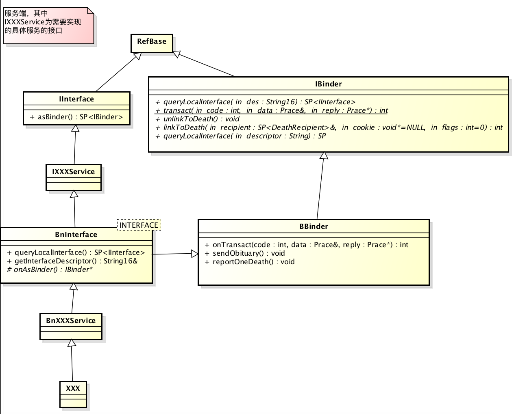
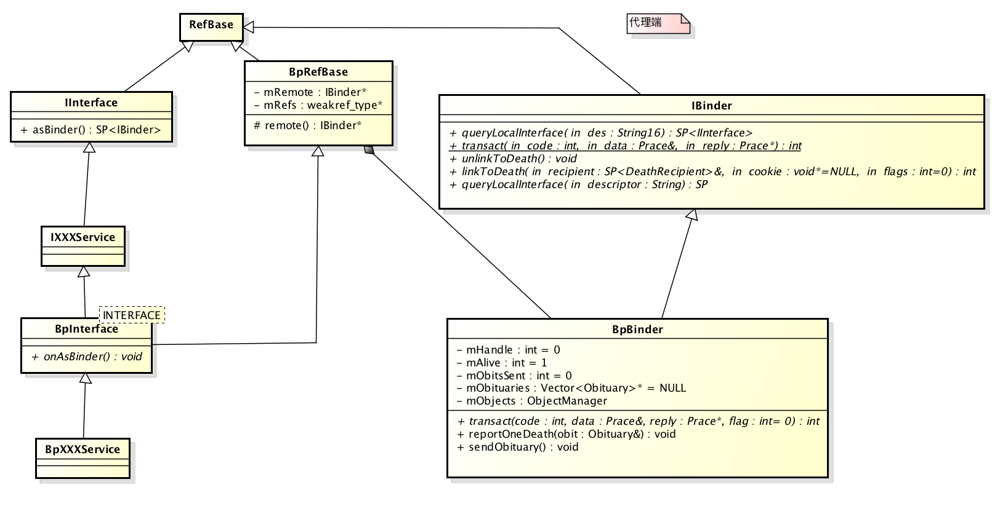
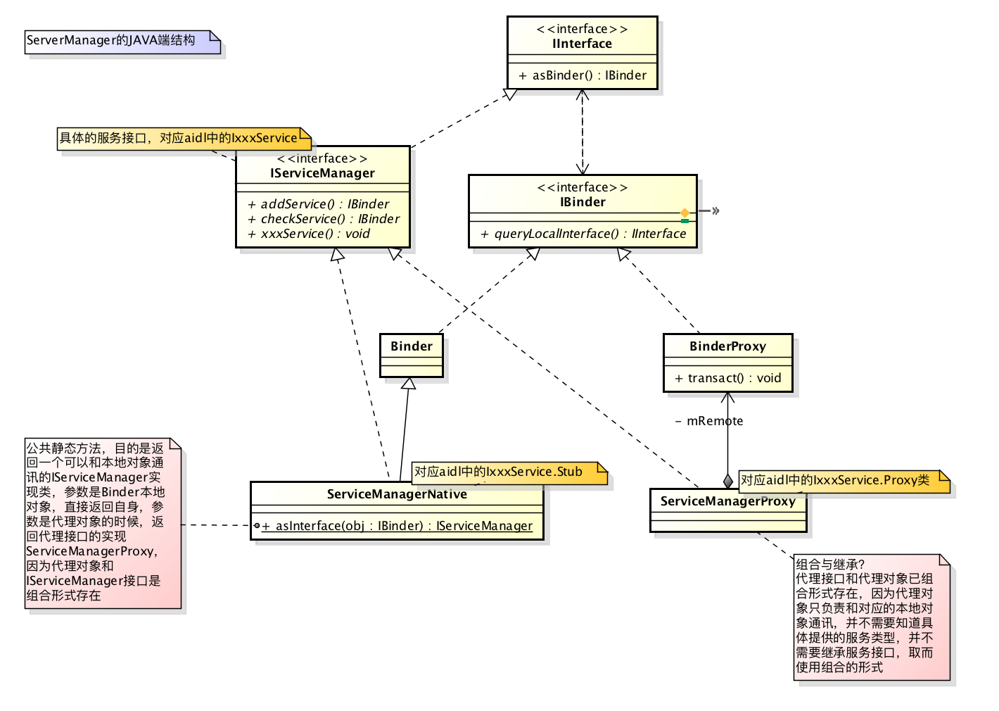

# 简述Binder实现原理

## 基本架构

`C/S`架构，每个`Server`服务端都有一个`Client`客户端，系统提供一个`ServiceManager`的服务端来统一管理系统各种`Server`的的注册，查询，移除等操作，各种个具体的`Client`其实都是通过`ServiceManager`的`Client`来查询、操作自己的服务端

## 四个概念

- `Server`，用来提供服务
- `Client`，用来获取服务
- `ServiceManager`，是Android系统的守护进程之一，`ServiceManager`永远都是一个`Server`，并用来管理系统的各种`Server`
- `Binder`驱动，主要通过一个叫`/dev/binder`的文件在内核空间和用户空间来交换数据，跟硬件没有什么关系

## 成为ServiceManager

`ServiceManager`本身就是一个进程，在`Android`启动`ServiceManager`进程的时候，都做了什么事？

- 首先打开`/dev/binder`设备文件`open("/dev/binder", O_RDWR);`

  - > 会在内核空间创建一个`binder_proc`数据结构来保存打开设备文件`/dev/binder`的进程的上下文信息，并且将这个进程上下文信息保存在打开文件结构`file`的私有数据成员变量`private_data`中这样，在执行其它文件操作时，就通过打开文件结构`file`来取回这个进程上下文信息了

- 建立128K内存映射`mmap(NULL, mapsize, PROT_READ, MAP_PRIVATE, bs->fd, 0);`

- 利用`BINDER_SET_CONTEXT_MGR`命令，令自己成为上下文管理者，其实也就是成为`ServiceManager`

  - 通过`ioctl`将`BINDER_SET_CONTEXT_MGR`命令传给`Binder`驱动的时候，`Binder`驱动就会为其在内核空间中创建一个`binder_node`(`Binder`实体对象，指定了其引用的binder本地对象和弱引用地址都为0，为了避免被销毁，其内部强弱引用指针均指定为1)，并赋值到全局变量`binder_context_mgr_node`，而这个节点所在的进程就是`ServiceManager`，所以只要是想找`ServiceManager`的进程，只要告诉`Binder`驱动，想访问的是句柄为0的进程，`Binder`驱动就知道，它们是在找`ServiceManager`

- 写入`BC_ENTER_LOOPER`命令到binder驱动（改变ServiceManager进程主线程的looper变量带上`BINDER_LOOPER_STATE_ENTERED`标识），进入一个无限循环，等待`Client`的请求到来

在这个过程中，在Binder驱动程序中建立了一个`struct binder_proc`结构、一个`struct binder_thread`结构和一个`struct binder_node`结构，这样，`ServiceManager`就在Android系统的进程间通信机制Binder担负起守护进程的职责了

## 获取ServiceManager代理对象

- 通过`ProcessState::getStrongProxyForHandle(0)`等价于`new BpBinder(0)`,`ProcessState`以单例存在，`ProcessState`会在构造的时候打开`/dev/binder`设备文件
- `ProcessState`内部缓存着`Vector<handle_entry>`来缓存着`Binder`代理对象，索引是句柄值

  - 这样下次从`Service Manager`那里请求得到相同的句柄时就可以直接返回这个`Binder`代理对象了，不用再创建一个出来

- 如果句柄值为0，并不是普通的构造一个Binder代理对象，像Binder驱动发送了这样一个`IBinder::PING_TRANSACTION`数据，检测是否已经销毁或者注册

- 获取的`ServiceManager`已全局单例保存在变量`gDefaultServiceManager`

这个过程就是根据句柄0构造一个Binder代理对象，再组成成具体的服务代理对象

## Binder驱动

主要通过一个叫`/dev/binder`的文件在内核空间和用户空间来交换数据，跟硬件没有什么关系。因为`Server`，`Client`和`ServiceManager`是运行在用户空间，不同的进程，彼此是不能互相访问的，但可以通过内核空间来传递数据，而`Binder`驱动是工作在内核空间中的。整个进程间通信的大部分工作都是通过 `open()`， `mmap()`和`ioctl()`等文件操作，在内核空间与用户空间中进进出出，来实现的

## 通信的过程

### 通信过程中的四种对象的引用关系

- 1.`Client`进程通过`Binder`代理对象通过`Binder`驱动向运行在`Server`进程中的`Binder`本地对象发送一个进程通信的请求，`Binder`驱动程序接着根据`Client`进程传递过来的`Binder`代理对象的句柄值找到对应的`Binder`引用对象
- 2.`Binder`驱动程序根据前面找到的`Binder`引用对象找到对应的`Binder`实体对象，并且创建一个事务（`binder_transaction`）来描述本茨进程间通信
- 3.`Binder`驱动程序根据前面找到的`Binder`实体对象找到运行在`Server`进程中的`Binder`本地对象，并且将Client进程传递过来的通信数据发送给它处理
- 4.Binder本地对象处理完Client进程的通信请求之后，就将通信结果返回给Binder驱动程序，Binder驱动程序接着就找到前面创建的事务
- 5.Binder驱动程序根据前面找到的事务的相关属性来找到发出通信请求的Client进程，并且通知Client进程返回结果给对应的Binder代理对象

这过程中，Binder代理对象依赖Binder引用对象，Binder引用对象又依赖Binder实体对象，Binder实体对象依赖于Binder本地对象，Android使用了引用计算技术来维护每一个Binder对象的生命周期

- 1.Binder代理对象创建的时候，会向当前的IPCTreadState的输出缓冲区写入BC_INCRREFS命令增加其引用对象的引用数
- 2.Binder引用对象的强弱引用数从0-1的时候，都会增加对应Binder实体对象的外部强弱引用（外部弱引用无效，因为已经有一个引用对象列表refs）
- 3.Binder实体对象增加外/内引用计算的时候，会通知Binder本地对象增加强引用计数

### 注册

每一个提供服务的`Server`都会通过`Binder`驱动，将自身给注册到`ServiceManager`中，方便众多想获取服务的`Client`可以去`ServiceManager`找到自己

- 1) 获取`ServiceManager`代理对象，目的是告诉`ServiceManager`需要注册服务，所以还需要打包发送需要注册的`Binder`本地服务、名字等信息
- 2）分配内核缓冲区，拷贝进程通信数据，如果是第一次碰到这个`Binder`对象或者对应的实体对象已经销毁，并没有在Server进程的红黑树中记录有对应的binder实体对象，会在内核空间中创建了一个`Binder`实体对象节点，隶属于Server进程，否则直接使用实体对象；同样如果是第一次碰到这个`Binder`对象或者对应的引用对象已经销毁，会在内核空间中创建了一个`Binder`引用对象节点，并分配一个非0的句柄值，这个句柄值只在当前`SM`进程唯一，**隶属于`SM`进程(这里多次搞混，`binder_get_ref_for_node(target_proc, node)`方法是在目标进程中分配的引用对象)**，否则直接使用引用对象；添加两个工作项分别到源线程工作队列和目标线/进程工作队列
- 3）Server线程接着和Binder驱动交互，读取到`BINDER_WORK_TRANSCTION_COMPLETE`工作项（写后读，读阻塞），接着Server线程进入下一次的通信等待；目标进程也就是`SM`线程在Binder驱动中获取到新的工作项，获取到进程间通信数据，上一步只是把通信数据拷贝到内核空间分配的缓冲区，所以这里需要转换成用户空间地址，这样才能使用，交由`SM`线程处理
- 4）`SM`解析通信数据，注册服务名，`Binder`驱动为之分配的句柄值，首先判断是否合法的注册（根据句柄值、名字长度、特定的UID，和允许注册的服务名表），`SM`使用`svcinfo`结构来表示已经注册的服务，记录了服务名和`Binder`驱动分配的句柄值（以便可以找到对应的引用对象），并维护一个链表，判断服务的依据是通过服务名，这样，Client来向`SM`查询服务接口时，只要给定服务名称，`SM`就可以返回相应的句柄值了
- 5）处理完进程通信后，还需要通知Binder驱动释放内核缓冲区、通知Server注册事务的完成，并等待下一次的服务请求

#### 注册过程中引起引用数的事件

- 1）在步骤二中，内核缓冲区在目标进程(SM)中分配的时候，增加了目标Binder实体对象的内部强引用
- 2）在步骤二中，在目标进程新建的引用对象并分配了句柄值之后，需要增加引用对象的引用数，这里的目的是避免过早销毁，这过程如果引用数是从0-1的话，还会增加对应实体对象的引用数和本地对象的引用数
- 3）在步骤五中，在处理完进程通信后，需要增加引用对象引用数。因为从SM角度来看，由于引用了新注册的Service组件，因此需要增加相应的Binder引用对象的引用数，避免过早的销毁，因为之后在释放缓冲区的时候需要减少引用对象引用数，如果减为0了，就要被销毁，实体对象也可能被销毁，之后的getService调用的时候，也不能在SM中查询到非NULL的引用对象
- 4）在步骤五中，释放内核缓冲区的时候，减少目标实体对象的引用数，并在使用内核缓冲区中的通信数据中保存了binder对象时候，binder驱动增加过这个binder引用对象的引用数，所以在释放缓冲区的时候减少引用数

### 访问

具体代理对象是通过和`BpBinder`这个`binder`代理对象组合使用的，`BpBinder`提供了应该和哪个`Binder`本地对象打交道，要得到某个服务对应的`BpBinder`，主要得借助`SM`系统服务，查询出一个合法的`Binder`句柄，并进而创建出合法的`BpBinder`

很显然，无论如何，`Client`得知道要跟谁通信，它们知道一个名字

- 1） 获取`ServiceManager`代理对象，告诉`ServiceManager`需要获取的服务名
- 2）`SM`根据名称找到在`SM`进程内分配的引用对象句柄值，并在`SM`进程中找到对应引用对象和引用了需要查找的Service组件的实体对象，并在`Client`进程建立新的引用对象分配新的句柄值来引用具体的实体对象
- 3）驱动再将这个句柄发回给`Client`
- 4）`Client`获取句柄之后，构造`BpBinder`，`BpBinder`组合成具体的`Binder`代理对象，就可以通过该句柄值和引用了特定Service组件的引用对象交互

### 为什么Binder只进行了一次数据拷贝？

Linux内核实际上没有从一个用户空间到另一个用户空间直接拷贝的函数，需要先用`copy_from_user()`拷贝到内核空间，再用`copy_to_user()`拷贝到另一个用户空间。为了实现用户空间到用户空间的拷贝，`mmap()`分配的内存除了映射进了接收方进程里，还映射进了内核空间。所以调用`copy_from_user()`将数据拷贝进内核空间也相当于拷贝进了接收方的用户空间，这就是Binder只需一次拷贝的'秘密'

## 附

### Native端Binder类框架

 

### Java端Binder类框架

