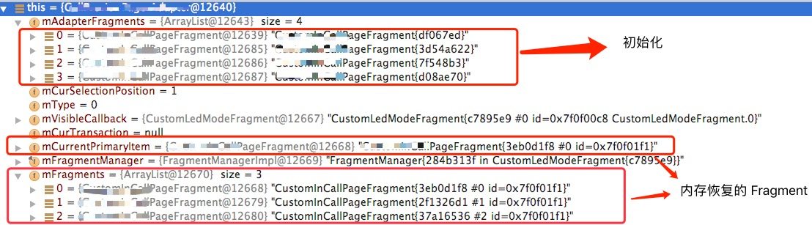

# FragmentPagerAdapter 和 FragmentStatePagerAdapter 的对比

按照官方的说法 `FragmentPagerAdapter` 会尽量保存 `Fragment` 在内存中，并不适合大量 `Fragment` 的场景，在有比较多 `Fragment` 的情况下，推荐使用 `FragmentStatePagerAdapter`，当 `Fragment` 不可见的时候，就可能会被 `destroy` 掉，只保存其 `Fragment` 状态，用于后续的恢复，这样可以减轻内存的负担

## 显示和移除的处理

### `FragmentPagerAdapter`

对于 `FragmentPagerAdapter` 来说，并不保存 `Fragment` 状态，会用 `attach` 配合 `detach` 来显示和轻量地移除 `Fragment`，所以并不需要保存状态

```java
@Override
public Object instantiateItem(ViewGroup container, int position) {
    //...
    // 如果已经在
    String name = makeFragmentName(container.getId(), itemId);  //"android:switcher:" + viewId + ":" + id
    Fragment fragment = mFragmentManager.findFragmentByTag(name); //内存恢复回来，也会优先找到内存中的Fragment，所以每次新建Fragment 的ArrayList来初始化也不需要担心？
    if (fragment != null) {
        mCurTransaction.attach(fragment);
    } else {
        fragment = getItem(position);
        mCurTransaction.add(container.getId(), fragment, makeFragmentName(container.getId(), itemId));
    }
    //...

    return fragment;
}
```

```java
@Override
public void destroyItem(ViewGroup container, int position, Object object) {
    //...
    mCurTransaction.detach((Fragment)object);
}
```

所以根据 `instantiateItem` 的逻辑来看，内存恢复回来，也会优先找到内存中的 `Fragment`，所以即使每次新建 `Fragment` 的列表来初始化也不需要担心，因为之前已经添加进去了的会复用，相应的 `getItem` 也不会被调用到的，所，看起来好像没什么问题，但是如果搭配 `OnPageChangeListener` 使用的时候，特别是我们通常会在 `OnPageChangeListener#onPageSelected` 方法中对特定的 `Fragment` 做一些特定的操作，例如展示动画的时候，这个 `Fragment` 的实例获取的方式就需要好好考虑的！如果不是从 `FragmentManager` 中恢复得来的，那么你操作的 `Fragment` 实例就不是现在内存中存在的 `Fragment` 了！！那么你的操作会无效并很有可能导致奔溃！！！所以需要做好 `Fragment` 恢复的工作。

`Fragment` 的恢复操作可以这样：

```java
//String name = makeFragmentName(container.getId(), itemId); //private 方法
String name = "android:switcher:" + viewId + ":" + id;
Fragment fragment = mFragmentManager.findFragmentByTag(name);
```

### `FragmentStatePagerAdapter`

通过 `add` 和 `remove` 的方式来添加和移除 `Fragment`，所以需要保存 `Fragment` 状态，在下次显示的时候恢复，保存的信息和 `Activity` 对 `Fragment` 的处理一样，可见 [内存回收/恢复](./内存回收.png)

```java
@Override
public Object instantiateItem(ViewGroup container, int position) {
    // 内存恢复的时候恢复`mFragments`，所以已经存在就不需要进行额外操作了
    if (mFragments.size() > position) {
        Fragment f = mFragments.get(position);
        if (f != null) {
            return f;
        }
    }
    //...
    Fragment fragment = getItem(position);
    if (mSavedState.size() > position) {
        Fragment.SavedState fss = mSavedState.get(position);
        if (fss != null) {
            fragment.setInitialSavedState(fss); //状态恢复
        }
    }
    while (mFragments.size() <= position) {
        mFragments.add(null);
    }
    //....
    mFragments.set(position, fragment);
    mCurTransaction.add(container.getId(), fragment);

    return fragment;
}
```

```java
@Override
public void destroyItem(ViewGroup container, int position, Object object) {
    Fragment fragment = (Fragment) object;
    //...
    while (mSavedState.size() <= position) {
        mSavedState.add(null);
    }
    mSavedState.set(position, fragment.isAdded() ? mFragmentManager.saveFragmentInstanceState(fragment) : null);  //状态保存见 ./内存回收.png
    mFragments.set(position, null);
    mCurTransaction.remove(fragment);
}
```

看到 `FragmentStatePagerAdapter` 并不刻意保存 `Fragment`，保存的是状态 `mFragmentManager.saveFragmentInstanceState(fragment)`，以便下次初始化的时候恢复，并可以看得出来的是，内存恢复后，查找已经存在的 `Fragment` 是在 `mFragments` 列表中查找的，`mFragments` 又是在 `restoreState` 中恢复的。同 `FragmentPagerAdapter` 一样，一般在初始化之前需要做好已存在的 `Fragment` 实例的恢复操作，且 `add` 操作并没添加 `tag`，`containerViewId` 也是一样，所以不能简单地通过 `mFragmentManager#findFragmentByTag` 和 `mFragmentManager#findFragmentById` 方法来定位



`Fragment` 的恢复操作可以这样：

1. 在 `instantiateItem` 方法中处理，但是发现 `OnPageChangeListener#onPageSelected` 第一次回调的时候，还没进行 `instantiateItem` 操作，时机上有点奇怪

  ```java
  @Override
  public Object instantiateItem(ViewGroup container, int position) {
  Fragment fragment = (Fragment) super.instantiateItem(container, position);
  if (mAdapterFragments.get(position) != fragment) {
  if (BuildConfig.DEBUG) {
  Log.w(TAG, "instantiateItem: fix " + position);
  }
  mAdapterFragments.set(position, fragment);
  }
  return fragment;
  }
  ```

2. 通过 `className` 来判定，但对于相同 `Fragment` 类，但有多种展示形式的 `Fragment` 来说就不适用了

3. 重写 `restoreState` 方法

```java
@Override
public void restoreState(Parcelable state, ClassLoader loader) {
    if (state != null) {
        Bundle bundle = (Bundle) state;
        bundle.setClassLoader(loader);
        Iterable<String> keys = bundle.keySet();
        for (String key : keys) {
            if (key.startsWith("f")) {
                int index = Integer.parseInt(key.substring(1));
                Fragment f = mFragmentManager.getFragment(bundle, key);
                if (f != null && f instanceof XXXFragment) {
                    if (BuildConfig.DEBUG) {
                        Log.w(TAG, "restoreState: fix " + index);
                    }
                    mAdapterFragments.set(index, (XXXFragment) f);
                } else {
                    Log.w(TAG, "Bad fragment at key " + key);
                }
            }
        }
    }
    super.restoreState(state, loader);
}
```

## 内存恢复

### `FragmentPagerAdapter`

不保留状态

```java
@Override
public Parcelable saveState() {
    return null;
}

@Override
public void restoreState(Parcelable state, ClassLoader loader) {
}
```

### `FragmentStatePagerAdapter`

保存 `mSavedState` 数组，里面保存了被移除的 `Fragment` 的状态和保存当前已经添加的 `Fragment`，`key` 为「 `f` + `index` 」

```java
@Override
public Parcelable saveState() {
    Bundle state = null;
    if (mSavedState.size() > 0) {
        state = new Bundle();
        Fragment.SavedState[] fss = new Fragment.SavedState[mSavedState.size()];
        mSavedState.toArray(fss);
        state.putParcelableArray("states", fss);
    }
    for (int i=0; i<mFragments.size(); i++) {
        Fragment f = mFragments.get(i);
        if (f != null && f.isAdded()) {
            if (state == null) {
                state = new Bundle();
            }
            String key = "f" + i;
            mFragmentManager.putFragment(state, key, f);
        }
    }
    return state;
}
```

```java
@Override
public void restoreState(Parcelable state, ClassLoader loader) {
    if (state != null) {
        Bundle bundle = (Bundle)state;
        bundle.setClassLoader(loader);
        Parcelable[] fss = bundle.getParcelableArray("states");
        mSavedState.clear();
        mFragments.clear();
        if (fss != null) {
            for (int i=0; i<fss.length; i++) {
                mSavedState.add((Fragment.SavedState)fss[i]);
            }
        }
        Iterable<String> keys = bundle.keySet();
        for (String key: keys) {
            if (key.startsWith("f")) {
                int index = Integer.parseInt(key.substring(1));
                Fragment f = mFragmentManager.getFragment(bundle, key);
                if (f != null) {
                    while (mFragments.size() <= index) {
                        mFragments.add(null);
                    }
                    //...
                    mFragments.set(index, f);
                } else {
                    Log.w(TAG, "Bad fragment at key " + key);
                }
            }
        }
    }
}
```
