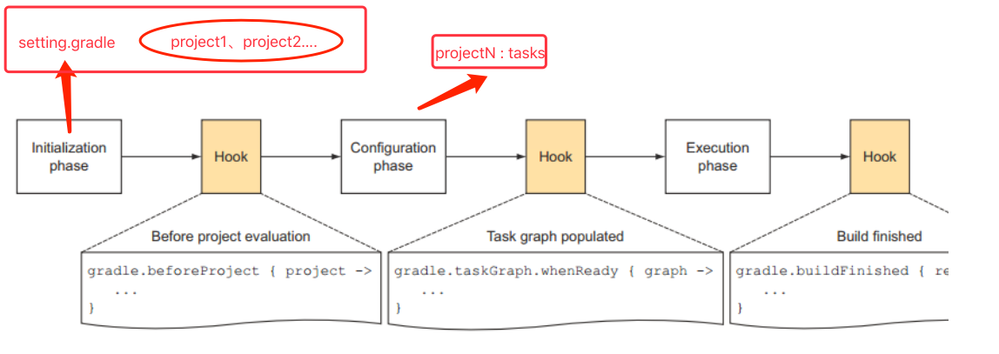

# Gradle 工作流程

## 生命周期



**settings.gradle**

```java
println 'This is executed during the initialization phase.'
```

`settings.gradle` 中定义了项目的 projecs，会在 Initialization 阶段被解析，所以上述定义在 `settings.gradle` 的代码会先执行

**build.gradle**

```java
println 'This is executed during the configuration phase.'

task configured {
    println 'This is also executed during the configuration phase.'
}

task test {
    doLast {
        println 'This is executed during the execution phase.'
    }
}

task testBoth {
    doFirst {
      println 'This is executed first during the execution phase.'
    }
    doLast {
      println 'This is executed last during the execution phase.'
    }
    println 'This is executed during the configuration phase as well.'
}
```

`build.gradle` 在配置阶段被解析，一个 Project 包含很多 Task，每个 Task 之间有依赖关系，Configuration 会建立一个有向图来描述 Task 之间的依赖关系

**OUTPUT**

```java
> gradle test testBoth
This is executed during the initialization phase.
This is executed during the configuration phase.
This is also executed during the configuration phase.
This is executed during the configuration phase as well.
:test
This is executed during the execution phase.
:testBoth
This is executed first during the execution phase.
This is executed last during the execution phase.

BUILD SUCCESSFUL

Total time: 1 secs
```

## 参考

[The Build Lifecycle](https://docs.gradle.org/current/userguide/build_lifecycle.html)
