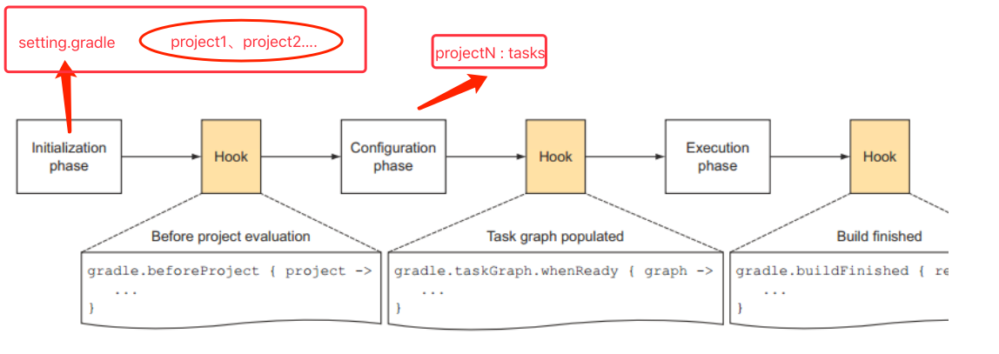

# Gradle 笔记2

DSL（领域相关语言），专门用来解决某一类任务，基于 Groovy 。Gradle 中，每一个待编译的工程都叫一个 Project。每一个 Project 在构建的时候都包含一系列的 Task

## 基本知识

Gradle 脚本是一种配置脚本。在脚本执行的时候将脚本转化成特定类型的对象。例如，项目编译脚本执行的时候，脚本将会转化成 Project 对象。这些对象叫脚本的委托对象。下面是不同 Gradle 脚本的委托对象

脚本类型            | 委托对象
:-------------- | :-------
Build script    | Project
Init script     | Gradle
Settings script | Settings

- Settings script

  一般是在 android 项目根目录下的 Setting.gradle 文件，用来配置项目编译的 project，且一定有一句这样的脚本

  ```gradle
  include ':app', ':app2', ':app3'
  ```

  为什么这样写，因为这代表着 Settings 对象的 include 方法，`void include(String[] projectPaths)`

- Build script

  Project 对象和 build.gradle 脚本一一对象，里面包含的若干 Tasks，编程成 classes 文件、执行单元测试等，Android 工程中一般开头有个 `apply` 的方法，就是对应了 Project#apply 方法

  ext 关键字用来来定义额外的属性，这样当前Project、子Project、Tasks 都可以读取和修改这些属性，只在定义的时候需要使用 ext，使用的时候可以直接使用

  ```groovy
  //在 Project 下定义
  project.ext.prop1 = "foo"
  // 在 Task 下定义
  task doStuff {
    ext.prop2 = "bar"
  }
  //在子 Project 下定义
  subprojects { ext.${prop3} = false }
  ```

- Init script

  是我们执行 `gradle assemble debug` 等命令的时候的脚本，委托对象为 Gradle 对象，所以整个编译过程只有一个 Gradle 对象，Gradle 会收集项目所有的 Project 来参与编译，过程：

  - 1.创建 Settings 对象实例

  - 2.执行 setting.gradle 脚本来对 Settings 对象进行配置

  - 3.使用配置好的 Settings 对象来创建参与编译的 Project 对象实例

  - 4.最后就是使用 Project 对象来执行参与编译的 build.gradle 脚本

### Task

Task 是 Project 的一个基本执行单元。`Project#getTasks` 可以返回一个 `TaskContainer`，里面有 Project 的一些列的 Task。`TaskContainer#create` 和 `Project.task` 方法都可以用来创建新的 Task，一般在 gradle 脚本中用 task 来新建，每个 Task 都有一个名字和一个唯一全限定名

```gradle
task myTask
task myTask { configure closure }   //Project 在创建这个 Task 之后，返回给用户之前，会先执行 closure 的内容
task myTask(type: SomeType)
task myTask(type: SomeType) { configure closure }
```

- Task Action

  一个 Task 包含若干 Action，执行的时候按顺序执行，Task 有 doFirst 和 doLast 两个函数，用于添加需要最先执行的 Action 和需要和需要最后执行的 Action（这里的 Action 可以是实现了 execute 方法的 Action 接口实例或者是一个 Closure，具体看 API 就可以）

  `StopActionException` 和 `StopExecutionException` 两个异常可以分别用来停止当前 Action 并执行下一个 Action 和停止当前 Task 并执行下一个 Task

- Task 依赖 and Task 的顺序

  一个 Task 可以依赖于另外一个 Task。Gradle 会保证被依赖的 Task 先执行，可以通过 `Task#dependsOn`、`Task#setDependsOn`、`Task#mustRunAfter`等一些列方法来指定 Task 的特定顺序

Task 创建的时候可以指定 Type，通过 `type:名字表达`。告诉 Gradle，这个新建的 Task 对象会从哪个基类 Task 派生。比如，Gradle 身提供了一些通用的 Task，最常见的有 Copy 任务。Copy 是 Gradle 中的一个类。当我们:task myTask(type:Copy)的时候，创建的 Task 就是一个 Copy Task，Copy Task 实现了 `CopySpec` 接口用来指定文件拷贝的规则和行为

### Gradle 脚本的结构

Gradle 脚本（也是一个 Groovy 脚本）由多个声明（方法执行、属性赋值和本地变量定义）和 Script Block 组成。SB 是一个接受一个 Closure 为参数的方法，这个 Closure 会配置一些委托对象来执行脚本，最高层级的 SB 如下：

Block              | Description
:----------------- | :------------------------------------------------------------------------------------------
allprojects { }    | Configures this project and each of its sub-projects.
artifacts { }      | Configures the published artifacts for this project.
buildscript { }    | Configures the build script classpath for this project. 委托对象 ScriptHandler
configurations { } | Configures the dependency configurations for this project. 用来配置 ConfigurationContainer
dependencies { }   | Configures the dependencies for this project. 委托对象 DependencyHandler
repositories { }   | Configures the repositories for this project.委托对象 RepositoryHandler
sourceSets { }     | Configures the source sets of this project. 用来配置 SourceSetContainer
subprojects { }    | Configures the sub-projects of this project.
publishing { }     | Configures the PublishingExtension added by the publishing plugin. 用来配置 PublishingExtension

因此，我们 Android 根目录下的 build.gradle 通常都有这样的一个配置的意义就不难理解了

```gradle
buildscript {
    repositories {
        jcenter()
    }
    dependencies {
        classpath 'com.android.tools.build:gradle:2.3.0'
    }
}

allprojects {
    repositories {
        jcenter()
    }
}
```

而 Android Gradle 插件项目有很多特有的SB，具体看 [Android Plugin DSL Reference](http://google.github.io/android-gradle-dsl/current/index.html) 和[官方教程](https://developer.android.com/studio/build/index.html)

接着根据参考来解析一下普通 Android Gradle 构建脚本

```gradle
// APK 编译必须加载这个插件
apply plugin: 'com.android.application'
// android {} SB 是用来配置 Android 编译选项的
android {
    compileSdkVersion compileSdk  // isRequired
    buildToolsVersion buildTools  // isRequired

    //所有构建类型编译的默认配置，可以配置什么？请转到 http://google.github.io/android-gradle-dsl/current/com.android.build.gradle.internal.dsl.ProductFlavor.html 中参考
    defaultConfig {
        applicationId "com.example.xxxxx"
        minSdkVersion minSdk
        targetSdkVersion targetSdk
        versionCode 1
        versionName "1.0"
        testInstrumentationRunner "android.support.test.runner.AndroidJUnitRunner"
    }
    //编译类型，http://google.github.io/android-gradle-dsl/current/com.android.build.gradle.internal.dsl.BuildType.html
    buildTypes {
        release {
            minifyEnabled false
            proguardFiles getDefaultProguardFile('proguard-android.txt'), 'proguard-rules.pro'
        }
    }
}
// dependencies 就不是 android 特定的 SB 了，定义了一系列的依赖
dependencies {
    compile fileTree(include: ['*.jar'], dir: 'libs')
    androidTestCompile('com.android.support.test.espresso:espresso-core:2.2.2', {
        exclude group: 'com.android.support', module: 'support-annotations'
    })
    compile 'com.android.support:appcompat-v7:26.+'
    compile 'com.android.support.constraint:constraint-layout:1.0.2'
    testCompile 'junit:junit:4.12'
}
```

## 生命周期



1.首先是初始化阶段，执行 settings.gradle，解析需要编译的 project

1.1 Hook，可以加通过 API 来添加一些定制化的 Hook

2.Configration 阶段的目标是解析每个 project 中的 build.gradle，建立一个有向图来描述 Task 之间的依赖关系

2.1 HOOK，当 Task 关系图建立好后，执行一些操作

3.Configuration 阶段完了后，整个 build 的 project 以及内部的 Task 关系就确定了，所以最后就是执行任务了

**settings.gradle**

```java
println 'This is executed during the initialization phase.'
```

`settings.gradle` 中定义了项目的 projects，会在 Initialization 阶段被解析，所以上述定义在 `settings.gradle` 的代码会先执行

**build.gradle**

```java
println 'This is executed during the configuration phase.'

task configured {
    println 'This is also executed during the configuration phase.'
}

task test {
    doLast {
        println 'This is executed during the execution phase.'
    }
}

task testBoth {
    doFirst {
      println 'This is executed first during the execution phase.'
    }
    doLast {
      println 'This is executed last during the execution phase.'
    }
    println 'This is executed during the configuration phase as well.'
}
```

`build.gradle` 在配置阶段被解析，一个 Project 包含很多 Task，每个 Task 之间有依赖关系，Configuration 会建立一个有向图来描述 Task 之间的依赖关系

**OUTPUT**

```java
> gradle test testBoth
This is executed during the initialization phase.
This is executed during the configuration phase.
This is also executed during the configuration phase.
This is executed during the configuration phase as well.
:test
This is executed during the execution phase.
:testBoth
This is executed first during the execution phase.
This is executed last during the execution phase.

BUILD SUCCESSFUL

Total time: 1 secs
```

## 参考

[The Build Lifecycle](https://docs.gradle.org/current/userguide/build_lifecycle.html)
