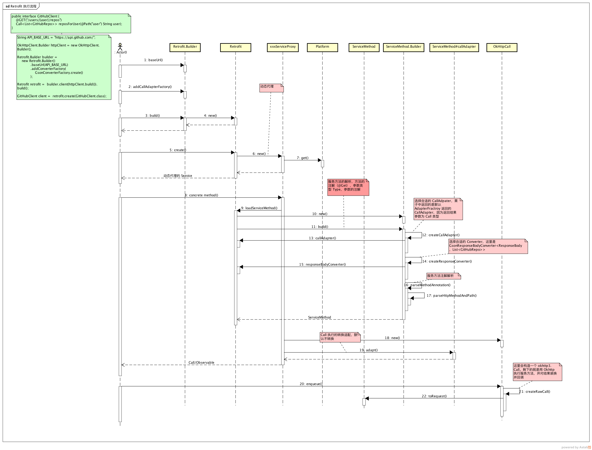

# Retrofit 浅析

## 几个对象

- `CallAdapter`

  `Retrofit` 默认的请求是通过 `OkHttp` 发起，并返回一个 `Call<?>` 对象，一般来说直接使用 `Call` 就可以了，但对于使用 `RxJava` 的用户来说更愿意获取一个 `Observable` 对象，以保证代码风格的同一，`CallAdapter` 的职责就是把请求 `Call` 封装成其他的对象

  以 `RxJava2` 为例，看看 `RxJava2` 和 `OkHttp` 的整合，`RxJava2CallAdapter` 把 `Call` 转化成 `Observable` 或 `Flowable`、`Single`、`Maybe`

  ```java
  final class RxJava2CallAdapter<R> implements CallAdapter<R, Object> {
  //...
  @Override public Object adapt(Call<R> call) {
    Observable<Response<R>> responseObservable = isAsync ? new CallEnqueueObservable<>(call) : new CallExecuteObservable<>(call);

    Observable<?> observable;
    if (isResult) {
      observable = new ResultObservable<>(responseObservable);
    } else if (isBody) {
      observable = new BodyObservable<>(responseObservable);  //还需要把 Observable<Response<R>> 转换成 Observable<R> 的形式
    } else {
      observable = responseObservable;
    }
    if (scheduler != null) {
      observable = observable.subscribeOn(scheduler);
    }
    if (isFlowable) {
      return observable.toFlowable(BackpressureStrategy.LATEST);  //Converts the current Observable into a Flowable by applying the specified backpressure strategy.
    }
    if (isSingle) {
      ////Returns a Single that emits the single item emitted by this Observable if this Observable emits only a single item,otherwise if this Observable completes without emitting any items or emits more than one item a NoSuchElementException or IllegalArgumentException will be signalled respectively.
      return observable.singleOrError();
    }
    if (isMaybe) {
      //Returns a Maybe that emits the single item emitted by this Observable if this Observable emits only a single item, otherwise if this Observable emits more than one item or no items, an IllegalArgumentException or NoSuchElementException is signalled respectively.
      return observable.singleElement();
    }
    return observable;
  }
  }
  ```

  同步请求数据源

  ```java
  final class CallExecuteObservable<T> extends Observable<Response<T>> {
  private final Call<T> originalCall;

  CallExecuteObservable(Call<T> originalCall) {
    this.originalCall = originalCall;
  }

  @Override protected void subscribeActual(Observer<? super Response<T>> observer) {
    // Since Call is a one-shot type, clone it for each new observer.
    Call<T> call = originalCall.clone();
    observer.onSubscribe(new CallDisposable(call));
    boolean terminated = false;
    try {
      Response<T> response = call.execute();
      if (!call.isCanceled()) {
        observer.onNext(response);
      }
      if (!call.isCanceled()) {
        terminated = true;
        observer.onComplete();
      }
    } catch (Throwable t) {
      //...
      if (terminated) {
        RxJavaPlugins.onError(t);
      } else if (!call.isCanceled()) {
        //...
        observer.onError(t);
      }
    }
  }

  private static final class CallDisposable implements Disposable {
    private final Call<?> call;

    CallDisposable(Call<?> call) {
      this.call = call;
    }

    @Override public void dispose() {
      call.cancel();
    }

    @Override public boolean isDisposed() {
      return call.isCanceled();
    }
  }
  }
  ```

- `Converter`

- `ServiceMethod`

  代表具体服务接口方法，当用具体服务接口构造出 `Retrofit` 对象的时候，使用的是动态代理的方式以便实现完成服务的具体逻辑

  ```java
  //...
  public <T> T create(final Class<T> service) {

  return (T) Proxy.newProxyInstance(service.getClassLoader(), new Class<?>[] { service },
      new InvocationHandler() {
        private final Platform platform = Platform.get();

        @Override public Object invoke(Object proxy, Method method, Object[] args)
            throws Throwable {
          // If the method is a method from Object then defer to normal invocation.
          //...
          ServiceMethod<Object, Object> serviceMethod = (ServiceMethod<Object, Object>) loadServiceMethod(method);
          OkHttpCall<Object> okHttpCall = new OkHttpCall<>(serviceMethod, args);
          return serviceMethod.callAdapter.adapt(okHttpCall);
        }
      });
    }
  `
  ```

然后，当调用具体方法的时候，调用 `Retrofit#loadServiceMethod` 方法来中获取（新建或缓存）代表该方法的 `ServiceMethod` 对象，`new ServiceMethod.Builder<>(this, method).build()`，新建的过程会根据注解信息、返回值等确定服务方法执行过程所需要的信息，请求方法、请求适配器、结果转换器等

```java
public ServiceMethod build() {
  callAdapter = createCallAdapter();  // 根据返回值确定 CallAdapter
  responseType = callAdapter.responseType(); //获取返回结果类型，如 Call<Foo> 得到的是 Foo
  if (responseType == Response.class || responseType == okhttp3.Response.class) {
    throw methodError("'" + Utils.getRawType(responseType).getName() + "' is not a valid response body type. Did you mean ResponseBody?");
  }
  responseConverter = createResponseConverter();

  for (Annotation annotation : methodAnnotations) {
    parseMethodAnnotation(annotation);  //服务方法的注解也决定了运行时的行为，需要一一解析
  }
  //...
  return new ServiceMethod<>(this);
  }
```

以 `CallAdapter` 来说，`createCallAdapter` 方法就是根据服务方法返回类型和注解来向 `Retrofit` 对象获取具体 `CallAdapter` 对象的

```java
private CallAdapter<T, R> createCallAdapter() {
  Type returnType = method.getGenericReturnType();
  //....
  Annotation[] annotations = method.getAnnotations();
  //..
  return (CallAdapter<T, R>) retrofit.callAdapter(returnType, annotations);
  }
```

而我们在配置 `Retrofit` 的时候可以指定自己 `CallAdapter$Factory`，是可以根据方法返回值类型来确定 `CallAdapter` 类型的，其默认是 `ExecutorCallAdapterFactory` 对象，接受的是 `Call` 为返回值的方法

```java
final class ExecutorCallAdapterFactory extends CallAdapter.Factory {
  final Executor callbackExecutor;
  //...
  @Override
  public CallAdapter<?, ?> get(Type returnType, Annotation[] annotations, Retrofit retrofit) {
    if (getRawType(returnType) != Call.class) { // Call 是 OKHttp 的请求
      return null;
    }
    final Type responseType = Utils.getCallResponseType(returnType);  //获取返回结果类型，如 Call<Foo> 得到的是 Foo
    return new CallAdapter<Object, Call<?>>() {

      @Override public Type responseType() {
        return responseType;
      }

      @Override public Call<Object> adapt(Call<Object> call) {
        return new ExecutorCallbackCall<>(callbackExecutor, call);  //静态代理原始 Call
      }
    };
  }
  }
```

同样的，我们也可以为 `Retrofit` 配置 `Converter.Factory` 来对结果进行转换，如 `GsonConverterFactory`

```java
public final class GsonConverterFactory extends Converter.Factory {
  private final Gson gson;
  //...
  @Override
  public Converter<ResponseBody, ?> responseBodyConverter(Type type, Annotation[] annotations, Retrofit retrofit) {
    TypeAdapter<?> adapter = gson.getAdapter(TypeToken.get(type));
    return new GsonResponseBodyConverter<>(gson, adapter);
  }

  @Override
  public Converter<?, RequestBody> requestBodyConverter(Type type,  Annotation[] parameterAnnotations, Annotation[] methodAnnotations, Retrofit retrofit) {
    TypeAdapter<?> adapter = gson.getAdapter(TypeToken.get(type));
    return new GsonRequestBodyConverter<>(gson, adapter);
  }
  }
```

`ServiceMethod` 新建完之后，就是执行

```java
OkHttpCall<Object> okHttpCall = new OkHttpCall<>(serviceMethod, args);
  return serviceMethod.callAdapter.adapt(okHttpCall);
```

这里新建一个 `OkHttpCall`，其实现了 `Call` 接口，但使用的是代理模式，对实际的 `okhttp3.Call` 进行代理

```java
final class OkHttpCall<T> implements Call<T> {
  private final ServiceMethod<T, ?> serviceMethod;
  private final Object[] args;

  private volatile boolean canceled;

  // All guarded by this.
  private okhttp3.Call rawCall;

  private boolean executed;

  OkHttpCall(ServiceMethod<T, ?> serviceMethod, Object[] args) {
    this.serviceMethod = serviceMethod;
    this.args = args;
  }
  //...

  @Override public synchronized Request request() {
    okhttp3.Call call = rawCall;
    if (call != null) {
      return call.request();
    }
    //..
      return (rawCall = createRawCall()).request();
    //...
  }

  private okhttp3.Call createRawCall() throws IOException {
    Request request = serviceMethod.toRequest(args);
    okhttp3.Call call = serviceMethod.callFactory.newCall(request);
    if (call == null) {
      throw new NullPointerException("Call.Factory returned null.");
    }
    return call;
  }
  //...
```

最后调用 `CallAdapter#adapt` 方法把请求封装成 `Call/Observable` 等，但实际上都是基于 `OkHttp` 发起的网络请求

## 请求执行流程


