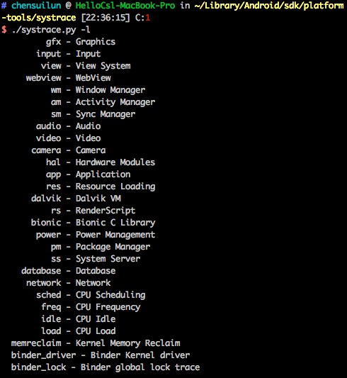

# Systrace 工具使用

`systrace` 可以用来收集和检测当前设备所有正在运行的进程的系统级别的运行信息，因此并不会收集你的应用执行的代码（可以自己标记，看下文）

语法：`python systrace.py [options] [categories]`

例如：`python systrace.py --time=10 -o mynewtrace.html gfx` 命令在 10 秒内记录设备进程的图形模块使用信息，输出文件为 `mynewtrace.html`

- options

  [更多 `options` 选项及其意义](https://developer.android.com/studio/command-line/systrace.html?hl=zh-cn#analysis)

- categories

  `categories` 标记你感兴趣的模块，电脑连接设备后通过 `./systrace.py -l` 命令即可查看可选的模块

  

## 实战 - 使用 systrace 探究 UI 性能问题

## 标记应用执行代码

对于 4.3 以上的用户，可以使用 `Trace` 类来标记你的应用执行的代码，需要在代码 `Trace.beginSection` 和 `Trace.endSection` 组合来标记 tag，并在使用 `systrace` 命令的时候使用 `-a app-name` 或者 `-app==app-name` 选项即可

## 参考

- [systrace](https://developer.android.com/studio/command-line/systrace.html?hl=zh-cn)
- [手把手教你使用Systrace（二）----锁优化](https://zhuanlan.zhihu.com/p/27535205)
- [手把手教你使用Systrace（一）](https://zhuanlan.zhihu.com/p/27331842)
