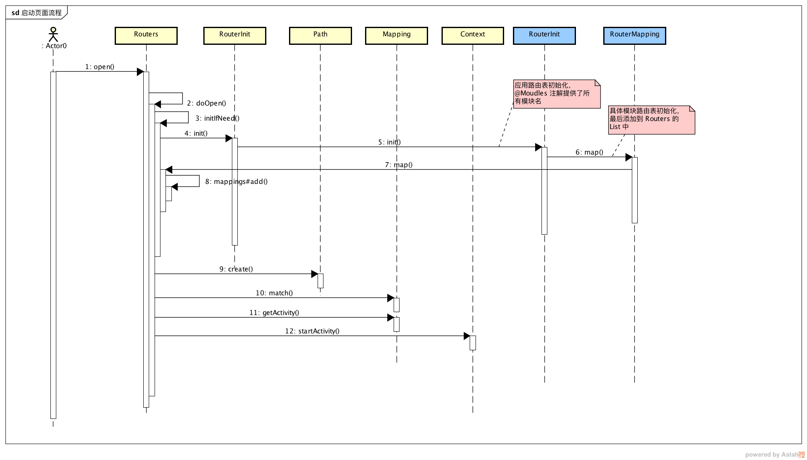
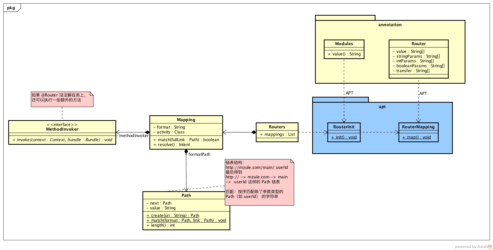
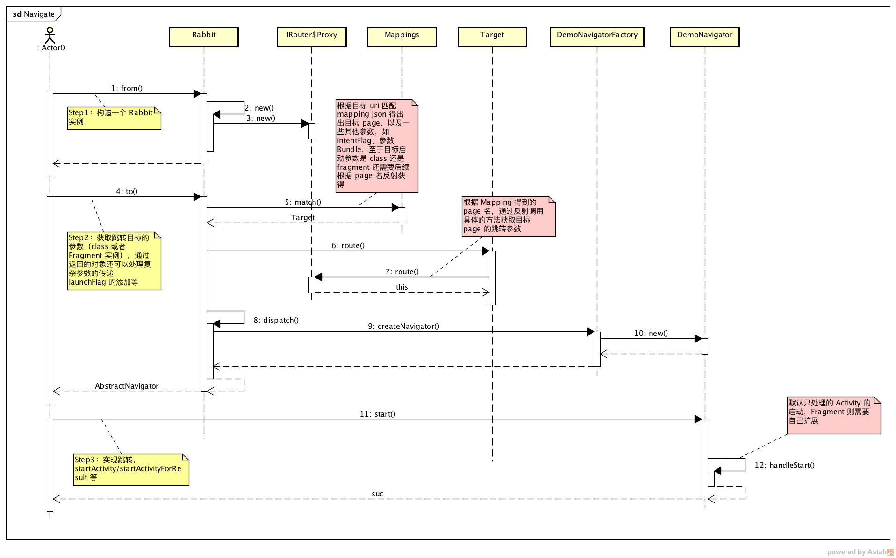
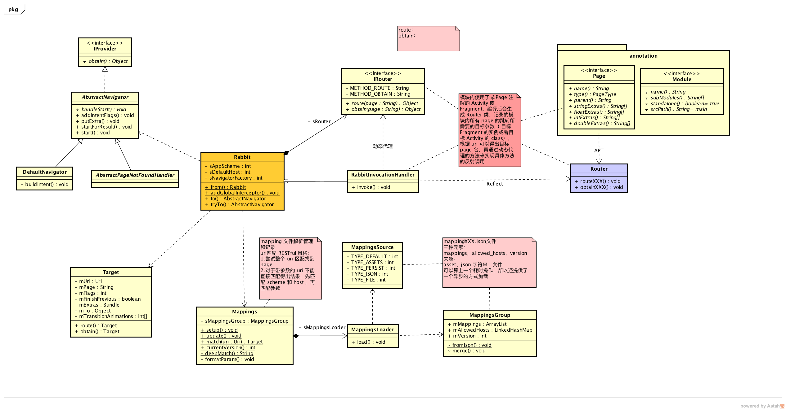

# Android 路由模块

## 为什么需要路由模块

方便不同的模块间相互跳转，增加模块间的独立性，而显示的 `startActivity` 方式显然是做不到的，而且简洁优雅，当然还有其他更多的优点

## 需要考虑实现的基本功能

- 1.`Activity` 和 `Fragment` 的跳转

- 2.跳转间的传参

- 3.跳转 `Activity` 的 `launcherFlag` 处理？

- 4.转场动画？

### 开源库分析

#### [ActivityRouter](https://github.com/mzule/ActivityRouter/)

**编译时注解**、**不支持 Fragment**、**多组件支持**

##### 实现

- 路由映射

  映射关系通过 `Router#map` 方法添加，`Mapping` 类记录了某个 `Page` 的映射路径

  初始化，会在第一使用的时候完成，使用 `@Module` 后的每个模块内会生成一个 `RouterMapping_xxx` 的类来初始化当前模块的路由表，主模块还需要使用 `@Modules` 声明，并会生成一个 `RouterInit` 类以实现所有模块的

  主模块初始化的时候，调用各个模块初始化自己的路由表

  ```java
  //APT 生成
  public final class RouterInit {
    public static final void init() {
      RouterMapping_app.map();
      RouterMapping_sdk.map();
    }
  }
  ```

  `app` 模块的路由表初始化

  ```java
  //APT 生成
  public final class RouterMapping_app {
    public static final void map() {
      //路由表初始化
      //...
      //@Router(value = "home/:homeName")
      com.github.mzule.activityrouter.router.Routers.map("home/:homeName", HomeActivity.class, null, extraTypes);
      //@Router("with_host")
      com.github.mzule.activityrouter.router.Routers.map("with_host", HostActivity.class, null, extraTypes);
      //@Router(value = {"http://mzule.com/main", "main", "home"})
      com.github.mzule.activityrouter.router.Routers.map("http://mzule.com/main", MainActivity.class, null, extraTypes);
      com.github.mzule.activityrouter.router.Routers.map("main", MainActivity.class, null, extraTypes);
      com.github.mzule.activityrouter.router.Routers.map("home", MainActivity.class, null, extraTypes);
      //...
      }
    }
  ```

  - 启动页面

  最后通过 `Routers#doOpen` 来启动一个 `Activity`

  ```java
  private static boolean doOpen(Context context, Uri uri, int requestCode) {
    initIfNeed();
    Path path = Path.create(uri);
    for (Mapping mapping : mappings) {
        if (mapping.match(path)) {
            if (mapping.getActivity() == null) {
                mapping.getMethod().invoke(context, mapping.parseExtras(uri));
                return true;
            }
            Intent intent = new Intent(context, mapping.getActivity());
            //...
            if (requestCode >= 0) {
              //...
            } else {
                context.startActivity(intent);
            }
            return true;
        }
    }
    return false;
  }
  ```

  - 参数传递

  可以通过 `url` 来传递一些基本类型的参数，如果需要传递对象类型的数据或者添加 `launchFlag`，只能通过 `Router#resolve` 方法来返回一个 `Intent`对象，这无疑打破的代码的简洁和优雅性，可以考虑构造一个新的对象来负责跳转和跳转前额外参数的添加职责（后面说的 Rabbit 就更合理且优雅）

  - 具体流程

    

  - 类图

    

#### [Rabbits](https://github.com/kyleduo/Rabbits)

特点：**编译时注解**、**拦截器**、**mappings更新（似乎没什么用？）**、**多组件支持**、 **Fragment 支持（需要自己扩展）**

##### 实现

- page 的映射关系

  根据 `mappingsxxx.json` 路由表文件（每次初始化的时候都需要读取 json 文件，耗时会随着页面增多而增加），建立 `uri` = `page` 之间的联系 ，模块内使用了 `@Page(name = xxx)` 注解的 `Activity` 或 `Fragment`，编译后会生成 `Router` 类，记录的模块内所有 `page` 的跳转所需要的目标参数（ 目标 `Fragment` 的实例或者目标 `Activity` 的 `class` ），最后根据 `uri` 可以得出目标 `page` 名，再通过动态代理的方法来实现具体方法的反射调用

  mappings 表，指定了路径、参数和对应 `page` 名：

  ```json
  {
  ...
  "mappings": {
  "demo://rabbits.kyleduo.com/test": "TEST",  
  "demo://rabbits.kyleduo.com/test/{testing}": "TEST",  //String 类型参数
  "demo://rabbits.kyleduo.com/second/{id:l}": "SECOND", //long 类型，key 为 id
  "demo://rabbits.kyleduo.com/crazy/{name:s}/{age:i}/{finish:b}/end": "CRAZY"
  }
  }
  ```

  `APT` 生成的 `Router` 类，最后通过反射的方式调用

  ```java
  public final class Router {
  //...
  public static final SecondFragment routeSecond() {
    return new SecondFragment();
  }

  public static final Class routeTest() {
    return TestActivity.class;
  }
  ```

- `uri` 的匹配，先整个 `uri` 区配

  ```java
  Mappings.java

  static Target match(Uri uri) {
  //...uri 在没有 scheme 或者 host 的情况下会自动添加默认的
  uri = builder.build();
  Uri pureUri;
  //清除 fragment 和 query 片段
  if (Build.VERSION.SDK_INT < Build.VERSION_CODES.HONEYCOMB) {
    pureUri = builder.fragment(null).query(null).build();
  } else {
    pureUri = builder.fragment(null).clearQuery().build();
  }

  // Try to completely match.
  String page = sMappingsGroup.getMappings().get(pureUri.toString());
  Bundle bundle = null;
  if (page == null) {
    // Deep match.
    bundle = new Bundle();
    page = deepMatch(pureUri, bundle);
  }
  bundle = parseParams(uri, bundle);  //query 片段的 key-value 存进 bundle
  //...
  if (page != null && !free) {
    // Match.
    Target target = new Target(uri);
    target.setPage(page);
    target.setExtras(bundle);
    target.setFlags(parseFlags(uri));
    return target;
  }
  }
  ```

  RESTful 风格的 `uri` 匹配

  ```java
  private static String deepMatch(Uri pureUri, Bundle bundle) {
  Set<String> uris = sMappingsGroup.getMappings().keySet();
  String[] source = pureUri.toString().split("(://|/)");
  UriLoop:
  for (String uri : uris) {
    // Check match for each uri.
    String[] template = uri.split("(://|/)");
    if (!template[0].equals(source[0]) || template.length != source.length) {
        continue;
    }
    if (!template[1].equals(source[1]) && (sMappingsGroup.getAllowedHosts() == null || !sMappingsGroup.getAllowedHosts().contains(source[1]))) {
        continue;
    }
    // Compare each part, parse params.
    for (int i = 2; i < source.length; i++) {
        String s = source[i];
        String t = template[i];
        if (t.equals(s)) {
            continue;
        }
        // Check whether a param field.
        if (t.matches("\\{\\S+(:\\S+)?\\}")) {  // {id:l} or {testing}
            try {
                formatParam(t, s, bundle);//基本参数类型的解析
            } catch (NumberFormatException e) {
                continue UriLoop;
            }
            continue; //参数都能匹配上才使用该 uri
        }
        continue UriLoop;
    }
    return sMappingsGroup.getMappings().get(uri);
  }
  return null;
  }
  ```

- 参数传递

  通过 `url` 来传参只能支持基本数据类型显然是不够用的，还需要提供额外的方式来做更多的处理，包括 `intentFlag` 的添加，`Rabbits#to` 方法的产物 `AbstractNavigator` 对象就可以处理更多的需求

- 具体流程

  

- 类图

  

### 小结

`Rabbit` 相对 `ActivityRouter` 来说功能更多，更具有可扩展性，`Rabbit` 的路由表需要从 `json` 文件中解析，这种方式来管理虽然可能使得路由看起来更清晰且可以动态更新，但毕竟是耗时操作，还是有些小顾虑，作者也提供了一个异步的加载方法，但我觉得可以考虑使用 `ActivityRouter` 的方式来实现更好，纯靠 `APT` 来生成路由映射关系

## 更多

- [Android路由框架设计](http://www.sixwolf.net/blog/2016/03/23/Android%E8%B7%AF%E7%94%B1%E6%A1%86%E6%9E%B6%E8%AE%BE%E8%AE%A1/)

- [Android Router从0到1](http://www.jianshu.com/p/22412a916e81?from=jiantop.com)
