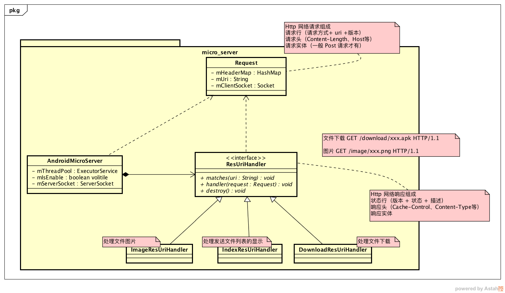

# Android 文件传输系统 - 网页传输模块

技术点：Android 发送端作为一个 Http 服务器，提供文件接收端来下载（同一个局域网内）和 Android 热点开启

## 热点开启

因为是隐藏的 API，所以需要使用反射，这部分没什么好说的

```java
//check whether wifi hotspot on or off
public static boolean isApOn(Context context) {
    WifiManager wifimanager = (WifiManager) context.getSystemService(context.WIFI_SERVICE);
    try {
        Method method = wifimanager.getClass().getDeclaredMethod("isWifiApEnabled");
        method.setAccessible(true);
        return (Boolean) method.invoke(wifimanager);
    }
    catch (Throwable ignored) {}
    return false;
}


//close wifi hotspot
public static void disableAp(Context context) {
    WifiManager wifimanager = (WifiManager) context.getSystemService(context.WIFI_SERVICE);
    try {
        Method method = wifimanager.getClass().getMethod("setWifiApEnabled", WifiConfiguration.class, boolean.class);
        method.invoke(wifimanager, null, false);
    } catch (Throwable ignored) {

    }
}

// toggle wifi hotspot on or off, and specify the hotspot name
public static boolean configApState(Context context, String apName) {
    WifiManager wifimanager = (WifiManager) context.getSystemService(context.WIFI_SERVICE);
    WifiConfiguration wificonfiguration = null;
    try {
        wificonfiguration = new WifiConfiguration();
        wificonfiguration.SSID = apName;
        // if WiFi is on, turn it off
        if(isApOn(context)) {
            wifimanager.setWifiEnabled(false);
            // if ap is on and then disable ap
            disableAp(context);
        }
        Method method = wifimanager.getClass().getMethod("setWifiApEnabled", WifiConfiguration.class, boolean.class);
        method.invoke(wifimanager, wificonfiguration, !isApOn(context));
        return true;
    }
    catch (Exception e) {
        e.printStackTrace();
    }
    return false;
}
```

### 搭建 HTTP 服务器

简单的 Http 服务器包括接受请求和发送响应两个阶段



#### 接受请求

使用 `ServerSocket` 使自己成为局域网中服务器，每当有客户端连接进来就会接受到一个 `Socket` 对象，即可和连接进来的客户端进行通信

```java
/**
 * start the android micro server
 */
public void start(){
    mThreadPool.submit(new Runnable() {
        @Override
        public void run() {
            try {
                mServerSocket = new ServerSocket(mPort);
                while(mIsEnable){
                    Socket socket = mServerSocket.accept();
                    hanldeSocketAsyn(socket);
                }
            } catch (IOException e) {
                e.printStackTrace();
            }
        }
    });
}
```

处理客户端的连接

```java
private void hanldeSocketAsyn(final Socket socket) {
    mThreadPool.submit(new Runnable() {
        @Override
        public void run() {
            //1\. auto create request object by the parameter socket
            Request request = createRequest(socket);

            //2\. loop the mResUriHandlerList, and assign the task to the specify ResUriHandler
            for(ResUriHandler resUriHandler : mResUriHandlerList){
                if(!resUriHandler.matches(request.getUri())){
                    continue;
                }
                resUriHandler.handler(request);
            }
        }
    });
}
```

用 `Request` 对象用来描述客户端的请求

```java
private Request createRequest(Socket socket) {
    Request request = new Request();
    request.setUnderlySocket(socket);
    try {
        //Get the reqeust line
        SocketAddress socketAddress = socket.getRemoteSocketAddress();
        InputStream is = socket.getInputStream();
        String requestLine = IOStreamUtils.readLine(is);  // Http请求的每一行都是以'\r\n'字节结尾的
        //请求行的组成如：GET /assets/download.png HTTP/1.1
        String requestType = requestLine.split(" ")[0];
        String requestUri = requestLine.split(" ")[1];
        request.setUri(requestUri);
        //Get the header line
        String header = "";
        while((header = IOStreamUtils.readLine(is)) != null){
            String headerKey = header.split(":")[0];
            String headerVal = header.split(":")[1];
            request.addHeader(headerKey, headerVal);
        }
    } catch (IOException e) {
        e.printStackTrace();
    }

    return request;
}
```

#### 发送响应

通过客户端的 `Socket` 对象可以获取到客户端的输出流，然后构造 `PrintStream` 流来发送响应结果

以响应列表为例

```java
@Override
public void handler(Request request) {
    //1.get the local index.html
    String indexHtml = null;
    try {
        InputStream is = this.mActivity.getAssets().open("index.html");
        indexHtml = IOStreamUtils.inputStreamToString(is);
    } catch (IOException e) {
        e.printStackTrace();
    }
    //2.send the data to the client like http protocal
    if(request.getUnderlySocket() != null && indexHtml != null){
        OutputStream outputStream = null;
        PrintStream printStream = null;
        try {
            outputStream = request.getClientSocket().getOutputStream();
            printStream = new PrintStream(outputStream);
            printStream.println("HTTP/1.1 200 OK");
            printStream.println("Content-Type:text/html");
            printStream.println("Cache-Control:no-cache");
            printStream.println("Pragma:no-cache");
            printStream.println("Expires:0");
            printStream.println();
            indexHtml = convert(indexHtml);
            byte[] bytes = indexHtml.getBytes("UTF-8");
            printStream.write(bytes);
            printStream.flush();
            printStream.close();
        } catch (IOException e) {
            e.printStackTrace();
        }finally {
          //...
        }
    }
}
```
