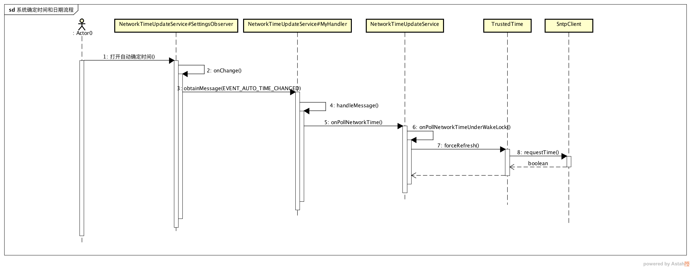

# Android 通过网络进行时间校准

需求：在客户端安装后一段时候后做某些不可描述的操作，普通情况下是通过手机时间来判断的，导致审核人员通过修改手机时间就可以触发到这些操作，所以需要使用网络时间来校准，类似的需求也应该还有很多的

因为系统本来就提供自动确定时间的功能，所以首先想到的是看看系统的实现，果然网上也能找到不少资料

系统的实现是通过 `NetworkTimeUpdateService` 这个类来实现的

> Monitors the network time and updates the system time if it is out of sync and there hasn't been any NITZ update from the carrier recently. If looking up the network time fails for some reason, it tries a few times with a short interval and then resets to checking on longer intervals. If the user enables AUTO_TIME, it will check immediately for the network time, if NITZ wasn't available.

上面是 `NetworkTimeUpdateService` 类的描述，就是用来保持系统时间和网络时间的同步的，并且有更新失败重试的机制，如果用户打开自动更新时间，优先会使用 `NITZ(Network Identity and Time Zone)` 机制来更新时间，而后才是 `NTP(Network Time Protocol)`

## NITZ 和 NTP

- `NITZ`（网络标识和时区），是一种用于自动配置本地的时间和日期的机制，需要运营商支持，可从运营商获取时间和**时区**具体信息

- `NTP`（网络时间协议），用来同步网络中各个计算机的时间的协议。在手机中，`NTP` 更新时间的方式是通过网络向特定服务器获取时间信息(不包含时区信息)

通过 `NITZ` 来更新时间依赖运营商，这样会比较被动，你不知道什么时候才会收到更新，且涉及到驱动层，个人能力问题，这里就不分析，但根据 `NetworkTimeUpdateService` 可以看出其实通过监听 `TelephonyIntents.ACTION_NETWORK_SET_TIME` 和 `TelephonyIntents.ACTION_NETWORK_SET_TIMEZONE` 广播来监听来自运营商的推送的

## NTP 确定系统时间

`NetworkTimeUpdateService#SettingsObserver` 类是 `ContentObserver`，用来监听自动更新时间这个配置的打开

```java

private static class SettingsObserver extends ContentObserver {
    //...
    //NetworkTimeUpdateService 启动的时候调用
    void observe(Context context) {
        ContentResolver resolver = context.getContentResolver();
        resolver.registerContentObserver(Settings.Global.getUriFor(Settings.Global.AUTO_TIME), false, this);
    }

    @Override
    public void onChange(boolean selfChange) {
        mHandler.obtainMessage(mMsg).sendToTarget();  //配置改变触发
    }
}
```

最后交由 `NetworkTimeUpdateService#MyHandler` 来处理

```java

private class MyHandler extends Handler {
    //...
    @Override
    public void handleMessage(Message msg) {
        switch (msg.what) {
            case EVENT_AUTO_TIME_CHANGED:
            case EVENT_POLL_NETWORK_TIME:
            case EVENT_NETWORK_CHANGED:
                onPollNetworkTime(msg.what);
                break;
        }
    }
}
```

一直跟踪

```java

private void onPollNetworkTime(int event) {
    if (!isAutomaticTimeRequested()) return;
    //...
    onPollNetworkTimeUnderWakeLock(event);
    //...
}

private void onPollNetworkTimeUnderWakeLock(int event) {
    final long refTime = SystemClock.elapsedRealtime();
    // If NITZ time was received less than mPollingIntervalMs time ago,
    // no need to sync to NTP.
    if (mNitzTimeSetTime != NOT_SET && refTime - mNitzTimeSetTime < mPollingIntervalMs) {
        resetAlarm(mPollingIntervalMs);
        return;
    }
    final long currentTime = System.currentTimeMillis();
    if (DBG) Log.d(TAG, "System time = " + currentTime);
    // Get the NTP time
    if (mLastNtpFetchTime == NOT_SET || refTime >= mLastNtpFetchTime + mPollingIntervalMs
            || event == EVENT_AUTO_TIME_CHANGED) {
        if (DBG) Log.d(TAG, "Before Ntp fetch");

        // force refresh NTP cache when outdated
        if (mTime.getCacheAge() >= mPollingIntervalMs) {
            mTime.forceRefresh();
        }
        //...
    }
    resetAlarm(mPollingIntervalMs);
}
```

其中 `mTime.forceRefresh` 正式强制使用 `NTP` 来更新时间，`mTime` 是 `NtpTrustedTime` 类型的单例对象，其记录了提供 `NTP` 的主机地址和超时时长，我看的是 25 版本的代码，主机是 `2.android.pool.ntp.org`

```java

public static synchronized NtpTrustedTime getInstance(Context context) {
    if (sSingleton == null) {
        final Resources res = context.getResources();
        final ContentResolver resolver = context.getContentResolver();

        final String defaultServer = res.getString(com.android.internal.R.string.config_ntpServer); //2.android.pool.ntp.org
        final long defaultTimeout = res.getInteger( com.android.internal.R.integer.config_ntpTimeout);//5000

        final String secureServer = Settings.Global.getString( resolver, Settings.Global.NTP_SERVER);
        final long timeout = Settings.Global.getLong(resolver, Settings.Global.NTP_TIMEOUT, defaultTimeout);  //5000

        final String server = secureServer != null ? secureServer : defaultServer;
        sSingleton = new NtpTrustedTime(server, timeout);
        sContext = context;
    }

    return sSingleton;
}
```

继续看它怎样更新时间

```java
NtpTrustedTime.java
@Override
public boolean forceRefresh() {
    //...
    final SntpClient client = new SntpClient();
    if (client.requestTime(mServer, (int) mTimeout)) {
        mHasCache = true;
        mCachedNtpTime = client.getNtpTime();
        mCachedNtpElapsedRealtime = client.getNtpTimeReference();
        mCachedNtpCertainty = client.getRoundTripTime() / 2;
        return true;
    } else {
        return false;
    }
}
```

这里出现了一个 `SntpClient` 类，并调用 `SntpClient#requestTime` 方法，应该就获取网络时间的具体方法

```java

public boolean requestTime(String host, int timeout) {
    InetAddress address = null;
    //..
    address = InetAddress.getByName(host);
    //...
    return requestTime(address, NTP_PORT, timeout);
}

public boolean requestTime(InetAddress address, int port, int timeout) {
    DatagramSocket socket = null;
    try {
        socket = new DatagramSocket();
        socket.setSoTimeout(timeout);
        byte[] buffer = new byte[NTP_PACKET_SIZE];
        DatagramPacket request = new DatagramPacket(buffer, buffer.length, address, port);

        // set mode = 3 (client) and version = 3
        // mode is in low 3 bits of first byte
        // version is in bits 3-5 of first byte
        buffer[0] = NTP_MODE_CLIENT | (NTP_VERSION << 3);

        // get current time and write it to the request packet
        final long requestTime = System.currentTimeMillis();
        final long requestTicks = SystemClock.elapsedRealtime();
        writeTimeStamp(buffer, TRANSMIT_TIME_OFFSET, requestTime);

        socket.send(request);

        // read the response
        DatagramPacket response = new DatagramPacket(buffer, buffer.length);
        socket.receive(response);
        final long responseTicks = SystemClock.elapsedRealtime();
        final long responseTime = requestTime + (responseTicks - requestTicks);

        // extract the results
        final byte leap = (byte) ((buffer[0] >> 6) & 0x3);
        final byte mode = (byte) (buffer[0] & 0x7);
        final int stratum = (int) (buffer[1] & 0xff);
        final long originateTime = readTimeStamp(buffer, ORIGINATE_TIME_OFFSET);
        final long receiveTime = readTimeStamp(buffer, RECEIVE_TIME_OFFSET);
        final long transmitTime = readTimeStamp(buffer, TRANSMIT_TIME_OFFSET);

        /* do sanity check according to RFC */
        // TODO: validate originateTime == requestTime.
        checkValidServerReply(leap, mode, stratum, transmitTime);

        long roundTripTime = responseTicks - requestTicks - (transmitTime - receiveTime);

        long clockOffset = ((receiveTime - originateTime) + (transmitTime - responseTime))/2;

        // save our results - use the times on this side of the network latency
        // (response rather than request time)
        mNtpTime = responseTime + clockOffset;
        mNtpTimeReference = responseTicks;
        mRoundTripTime = roundTripTime;
    } catch (Exception e) {
        if (DBG) Log.d(TAG, "request time failed: " + e);
        return false;
    } finally {
        if (socket != null) {
            socket.close();
        }
    }

    return true;
}
```

其通过 `DatagramPacket` 来实现 `UDP` 传输的，获取响应结果并解析，最后怎么计算得到网络时间这部分就不讲了

其实这个流程下来还是比较简单的，以下是这过程的流程图



## 最后

根据系统根据 `NTP` 获取时间流程，实现自己的网络时间获取也就不难了，主要是 `SntpClient` 和 `NtpTrustedTime` 这两个类来实现的，但是是 `@hide` 的，所以可以考虑直接拷贝代码或者通过反射的形式来实现即可，为了方便我使用反射的方式，代码以上传到了 `gist` 上，[NTUSUtils.java](https://gist.github.com/BCsl/dd30f8df6fe76b346b12295451aefbf6#file-ntusutils-java)

# 参考

- [Android 7.1.1时间更新NITZ和NTP详解](http://blog.csdn.net/yin1031468524/article/details/65447849?utm_source=tuicool&utm_medium=referral)
- [Android 时间更新机制研究](http://blog.csdn.net/pengtgimust/article/details/52469016)
