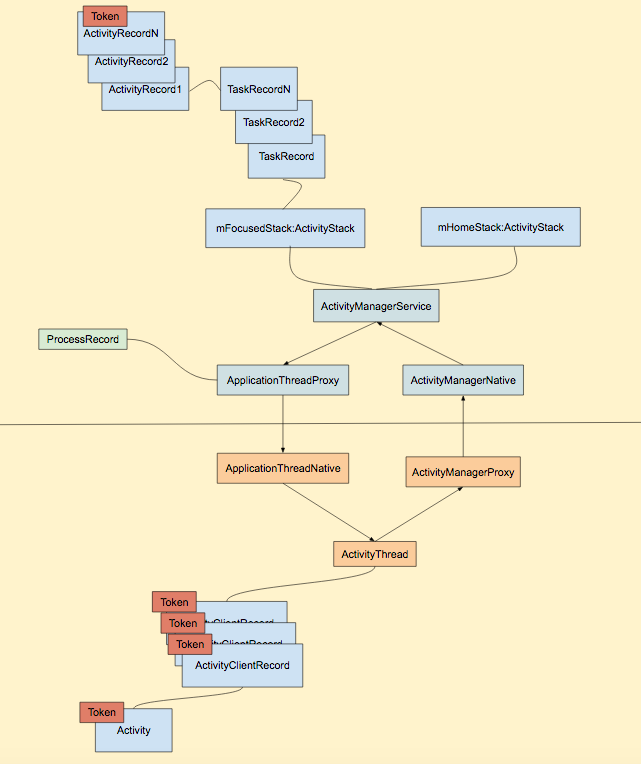
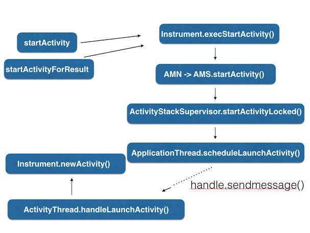
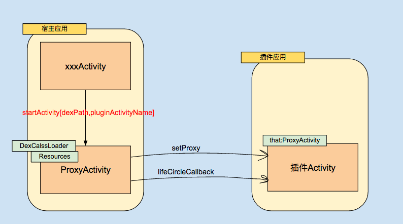

# 插件化之Activity生命周期管理

## Activity生命周期管理

想要动态创建 `Activity` 并不难，构造好插件的 `DexClassLoader` 即可，但 `Activity` 是有生命的，且生命周期是由 AMS 控制的，所以重点是在于如何对插件 `Activity` 进行生命周期管理

**限制**

- 需要在 AndroidManifest.xml 中显示声明目标 Activity，但是插件 Activity 一般都是不可预知的

### Activity的创建流程

简述：

- 发送 `Intent` 到 Ams 代表启动 `Activity` 的请求
- Ams 检测相关的启动权限、通过 PMS 解析待启动 `Activity` 的信息
- Ams 为需要启动的 `Activity` 创建一个 `ActivityRecord` 对象，并保存
- Ams 调度待启动的 `Activity` 的生命周期，首先是 create 阶段，Ams 通知 `ActivityThread` 可以启动 `Activity`，并把 `ActivityRecord` 对象的 `Binder` 类型的成员变量 `Token` 发送过来
- `ActivityThread` 为要启动的 `Activity` 创建 `ActivityClientRecord` 对象，关联 `Token`，并保存
- 调用 `Instrumentation` 来调度 `Activity` 的 Create 阶段，根据 `ActivityClientRecord` 信息通过反射创建具体的 `Activity` 对象，并关联好两个对象
- 接着还是借助 `Instrumentation` 来调度 `Activity` 的生命周期回调

Activity 的检测是在 AMS 我们不能避免，但 Activity 的创建实际是在 Client 端 `Instrumentation` 处理，所以我们还是可以瞒天过海的

主流插件库的对比：

- 1.代理，代表库[dynamic-load-apk](https://github.com/singwhatiwanna/dynamic-load-apk)

在启动 `ProxyActivity` 的时候传递插件包的路径和需要启动的 `Activity` 的全限定名，根据这些信息 `ProxyActivity` 可以构造插件包的 `Resources` 对象，和 `DexClassLoader` 的类加载器，通过约束好的 `setProxy` 方法，把 `ProxyActivity` 记录在插件 Activity 中，可以通过 `that` 关键字来获取，这样就可以解决资源读取的问题，并且 `ProxyActivity` 在其生命周期回调的时候回调给插件 `Activity`，这就可以解决生命周期回调的问题

- 2.Hook 掉 Instrumentation 创建 Activity

从 Activity 的启动过程描述，知道 `ActivityThread` 接受到来自 AMS 的关于`Activity` 管理事件的时候，最后都交由 `Instrumentation` 来处理(`Activity` 创建、生命周期回调等)，其中 `Instrumentation#newActivity` 方法创建一个新的 `Activity` 后（使用插件的 ClassLoader 来创建），将与在 `ActivityThread#scheduleLaunchActivity` 中创建的 `ActivityClientRecord`进行关联，最后的关系如下 `AMS(ActivityStack)`-`ActivityThread(ActivityClientRecord)`-`Activity`，在后续的生命周期回调的时候就不需要进行额外的操作了，系统帮我们搞定（尚不考虑资源加载）

- 3.Hook掉AMS

AMS 启动一个 Activity 的时候，具体是 `ActivityManagerProxy#startActivity` 的时候，把插件 `Intent` 替换成代理 `Intent`，已欺骗 AMS，在 `ApplicationThread` 处理 `LAUNCH_ACTIVITY` 的消息的时候修改 `ActivityClientRecord` 的 `intent` 值，之后具体的 `Activity` 会根据这个 `Intent` 来创建的，仅仅这样还不行，还需要把插件包的 dex 加载到系统的 `ClassLoader` ，类似于 `MultiDex` 的方式（尚不考虑资源加载）

### 参考

- [免安装运行Activity（上）](http://blog.csdn.net/maplejaw_/article/details/51530442)

- [免安装运行Activity（下）](http://blog.csdn.net/maplejaw_/article/details/51587987)

- [Android Small插件化框架--启动插件Activity源码解析(上)](http://blog.csdn.net/qq_21920435/article/details/52943370?utm_source=itdadao&utm_medium=referral)
