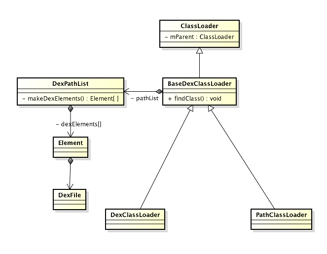
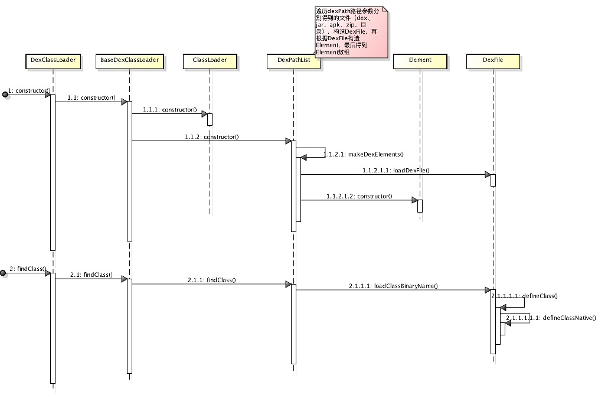
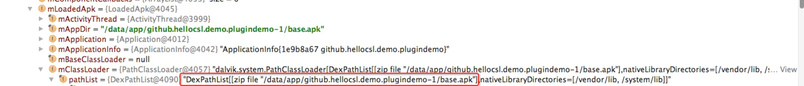

# Android类加载机制

在JAVA中，JAVA虚拟机可以加载.class文件，最终形成可以被虚拟机直接使用的Java类型，这就是虚拟机的类加载机制。而在android的`Dalvik`环境下对应的是.dex文件

## ClassLoader

- 父类委托机制

  - 从已装载过的类中找
  - 如果从已装载过的列表中找不到，则从父类装载
  - 如果父类找不到，从子类装载

解决的问题，确定某一个类，需要**类的全限定名以及加载此类的`ClassLoader`来共同确定**。也就是说即使两个类的全限定名是相同的，但是因为不同的`ClassLoader`加载了此类，那么在JVM中它是不同的类。采用了委托模型以后加大了不同的 `ClassLoader`的交互能力，比如JDK本生提供的类库，比如`HashMap`,`LinkedList`等等，这些类由bootstrp类加载器加载了以后，无论你程序中有多少个类加载器，那么这些类其实都是可以共享的，这样就避免了不同的类加载器加载了同样名字的不同类以后造成混乱

DexClassLoader和PathClassLoader，对于PathClassLoader，Android是使用这个类作为其系统类和应用类的加载器，只能去加载已经安装到Android系统中的apk文件。而DexClassLoader可以用来从.jar和.apk类型的文件内部加载classes.dex文件，可以用来执行非安装的程序代码。

### DexClassLoader

参数                 | 意义
:----------------- | :----------------------------------------------------------------------
dexPath            | 以":"分割的jar/apk/zip/dex文件路径
optimizedDirectory | 不能为null，用于输出优化后的dex文件，要求私有的，可写的目录，sdk推荐使用`Context.getCodeCacheDir()`来创建
librarySearchPath  | 以":"分割的Native库路径
parent             | 父类加载器

从构造参数便可以知道`DexClassLoader`加载指定的jar/apk/zip/dex文件路径下的类

一般情况下，通过`context.getClassLoader`返回的都是同一个`DexClassLoader`，记录在`LoadedApk#mBaseClassLoader`变量下，这个变量

### PathClassLoader

`PathClassLoader`会去去读取`/data/dalvik-cache`目录下的经过Dalvik优化过的dex文件，这个目录的dex文件是在安装apk包的时候由Dalvik生成的。虽说只能加载已经安装的APK/dex，但亲测5.0的手机上也是可以加载插件包dex的，所以说在art虚拟机上PathClassLoader可以加载未安装的apk的dex，而dalvik上无法使用，但还是猜测，可见[Android热修复学习](http://blog.csdn.net/xiandan87/article/details/51734200)和[Android动态加载之ClassLoader详解](http://www.jianshu.com/p/a620e368389a)对PathClassLoader的描述

## 参考

- [Android 插件化原理解析----插件加载机制](http://weishu.me/2016/04/05/understand-plugin-framework-classloader/)

- [Android插件原理剖析](http://www.alloyteam.com/2014/04/android-cha-jian-yuan-li-pou-xi/?utm_source=tuicool&utm_medium=referral)

- [Android插件化探索系列](http://blog.csdn.net/maplejaw_/article/details/51596374)

- [从源码分析 Android dexClassLoader 加载机制原理](http://blog.csdn.net/nanzhiwen666/article/details/50515895)

- [Android热修复学习](http://blog.csdn.net/xiandan87/article/details/51734200)

- [Android App 如何动态加载类](http://blog.csdn.net/quaful/article/details/6096951)
