# Android 代码热修复原理

主要以[RocooFix](https://github.com/dodola/RocooFix/) 为分析例子

## 1、方案（底层、类加载方案）

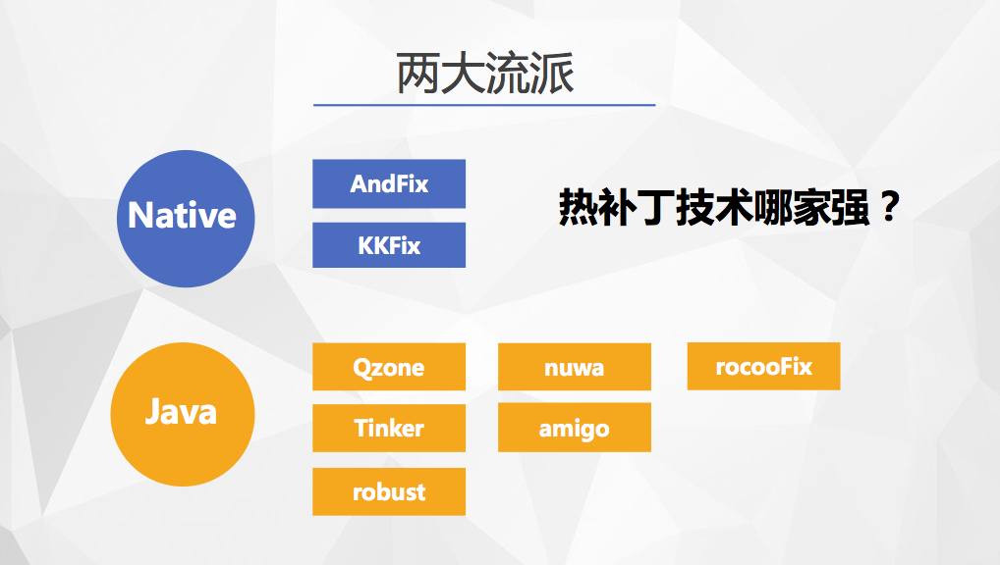

两种方案的优劣：

- 底层替换方案限制比较多，但时效性高，可以立即生效
- 类加载方案方案修复范围广，限制少，时效性差，需要重新启动安装补丁

### 底层替换方案

直接在 Native 层把已经加载的类中的方法实体进行替换，在原来的类的基础上进行修改。但没法实现对原有类的方法和字段增减，因为会破坏原有类的结构，导致整个 Dex 方法数的变化，这样在访问方法的时候就无法正常索引到正确方法

### 类加载方案

类加载方案的原理是在 app 重新启动后让 ClassLoader 去加载新的类。因为在 app 运行到一半的时候，所需要发生变更的类已经被加载过了，在 Android 上是无法对一个类进行卸载的。如果不重启，原来的类还在虚拟机中（类缓存机制），就无法加载新类。所以需要重新启动程序，并在没走到业务逻辑之前加载补丁中的新类

## 2、类加载机制

在 JAVA 中，JAVA 虚拟机可以加载 .class 文件，最终形成可以被虚拟机直接使用的 Java 类型，这就是虚拟机的类加载机制。而在 Android 的 `Dalvik/Art` 环境下对应的是 .dex 文件

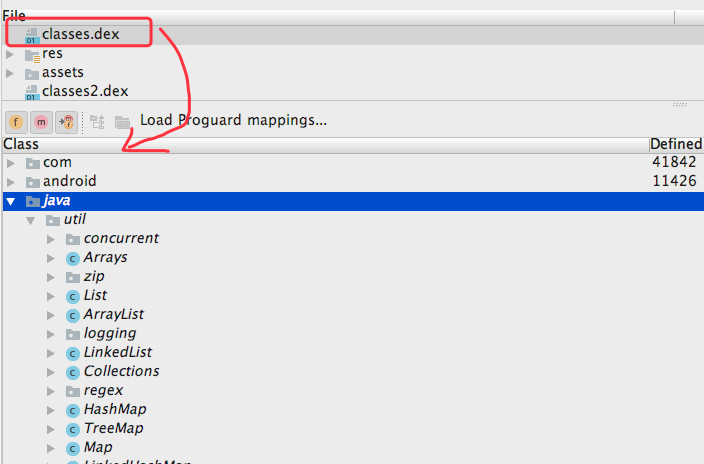

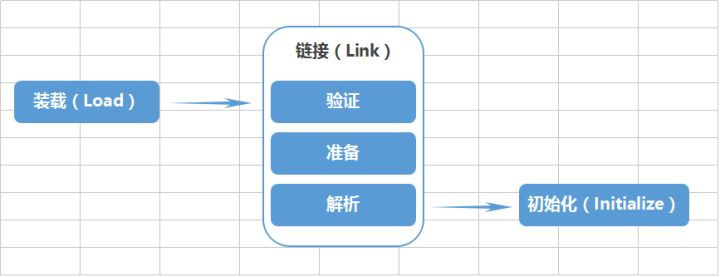

### 2.1、类的装载

> 类加载器并不需要等到某个类被"首次主动使用"时再加载它，JVM规范允许类加载器在预料某个类将要被使用时就预先加载它，如果在预先加载的过程中遇到了.class文件缺失或存在错误，类加载器必须在程序首次主动使用该类时才报告错误（LinkageError错误）如果这个类一直没有被程序主动使用，那么类加载器就不会报告错误

类的加载指的是将类的 .class 文件中的二进制数据读入到内存中，将其放在运行时数据区的**方法区**内，然后在**堆区**创建一个 `java.lang.Class` 对象，用来封装类在方法区内的数据结构。类的加载的最终产品是位于堆区中的 `Class` 对象，`Class` 对象封装了类在方法区内的数据结构，并且向 Java 程序员提供了访问方法区内的数据结构的接口

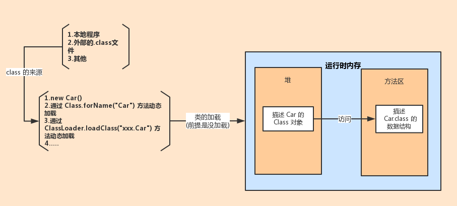

### 2.2、链接

- 验证：确保被加载的类的正确性

  文件格式验证，元数据验证，字节码验证，符号引用验证

- 准备：为类的静态变量分配内存，并将其初始化为默认值（如0、0L、null、false等）

- 解析：把类中的符号引用转换为直接引用

### 2.3、初始化：对类的静态变量，静态代码块执行初始化操作

时机（这个类还没有被加载和链接，那先进行加载和链接）

- 创建类的实例，也就是 new 一个对象
- 访问某个类或接口的静态变量，或者对该静态变量赋值
- 调用类的静态方法
- Class.forName("xxx.xxx.xxx")
- 初始化一个类的子类

### 2.4、ClassLoader

JVM 的类加载是通过 ClassLoader 及其子类来完成的

- 父类委托机制

  - 从已装载过的类中找（缓存机制）
  - 如果从已装载过的列表中找不到，则从父类装载
  - 如果父类找不到，从子类装载

`ClassLoader#loadClass` 方法

```java
ClassLoader.java

protected Class<?> loadClass(String name, boolean resolve) throws ClassNotFoundException{
        // First, check if the class has already been loaded
        Class c = findLoadedClass(name);
        if (c == null) {
            long t0 = System.nanoTime();
            try {
                if (parent != null) {
                    c = parent.loadClass(name, false);
                } else {
                    c = findBootstrapClassOrNull(name);
                }
            } catch (ClassNotFoundException e) {
                // ClassNotFoundException thrown if class not found from the non-null parent class loader
            }
            if (c == null) {
                // If still not found, then invoke findClass in order to find the class.
                long t1 = System.nanoTime();
                c = findClass(name);
                // this is the defining class loader; record the stats
            }
        }
        return c;
}
```

- 全盘委托机制

  - 指一个 ClassLoader 装载一个类时，除非显示使用另一个 ClassLoader，该类所依赖及引用的类也由这个 ClassLoader 载入

解决的问题，确定某一个类，需要**类的全限定名以及加载此类的`ClassLoader`来共同确定**。也就是说即使两个类的全限定名是相同的，但是因为不同的`ClassLoader`加载了此类，那么在JVM中它是不同的类。采用了委托模型以后加大了不同的 `ClassLoader`的交互能力，比如JDK本生提供的类库，比如`HashMap`,`LinkedList`等等，这些类由bootstrp类加载器加载了以后，无论你程序中有多少个类加载器，那么这些类其实都是可以共享的，这样就避免了不同的类加载器加载了同样名字的不同类以后造成混乱

### 2.5、Android 中的 PathClassLoader 和 DexClassLoader

在 Android 中，提供了 `PathClassLoader` 和 `DexClassLoader` 两个加载器，它们都继承于 `BaseDexClassLoader`，而 `BaseDexClassLoader` 则继承于 `ClassLoader`。对于 `PathClassLoader` ，Android 是使用这个类作为其系统类和已安装应用类的加载器。而 `DexClassLoader` 可以用来从 JAR/ZIP/APK 类型的文件内部加载 classes.dex 文件，可以用来执行非安装的程序代码

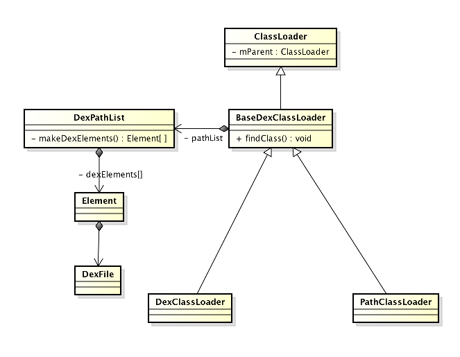

实际区别在于构造函数少了 `optimizedDirectory` 参数

参数                 | 意义
:----------------- | :----------------------------------------------------------------------
dexPath            | 以":"分割的 jar/apk/zip/dex 文件路径
optimizedDirectory | 制定输出 dex 优化后的 odex 文件，要求私有的，可写的目录，sdk推荐使用`Context.getCodeCacheDir()`来创建
librarySearchPath  | 以":"分割的 Native 库路径
parent             | 父类加载器

DexClassLoader 初始化和加载类的过程

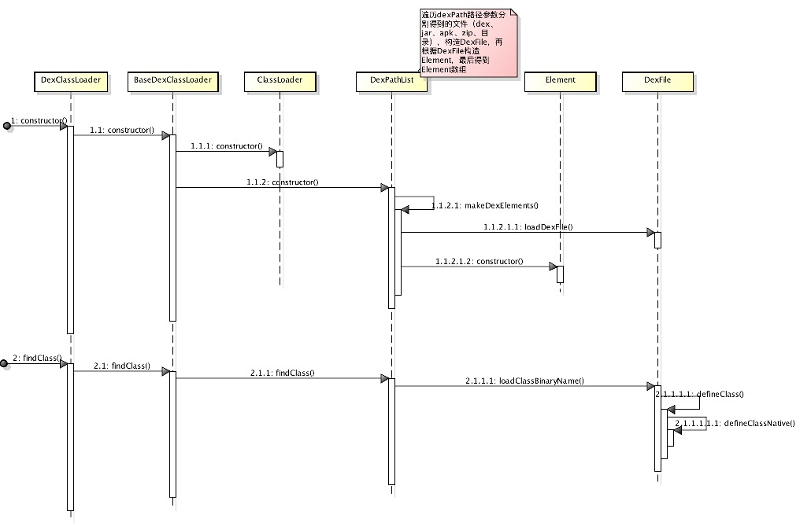

初始化构造 Element 数组

```java

private static final String DEX_SUFFIX = ".dex";
private static final String zipSeparator = "!/";

private static Element[] makeElements(List<File> files, File optimizedDirectory,
                                      List<IOException> suppressedExceptions,
                                      boolean ignoreDexFiles,
                                      ClassLoader loader) {
    Element[] elements = new Element[files.size()];
    int elementsPos = 0;
    for (File file : files) {
        File zip = null;
        File dir = new File("");
        DexFile dex = null;
        String path = file.getPath();
        String name = file.getName();
        if (path.contains(zipSeparator)) {
            String split[] = path.split(zipSeparator, 2);
            zip = new File(split[0]);
            dir = new File(split[1]);
        } else if (file.isDirectory()) {
            // We support directories for looking up resources and native libraries.
            elements[elementsPos++] = new Element(file, true, null, null);
        } else if (file.isFile()) {
            if (!ignoreDexFiles && name.endsWith(DEX_SUFFIX)) {
                // Raw dex file (not inside a zip/jar).
                try {
                    dex = loadDexFile(file, optimizedDirectory, loader, elements);
                } catch (IOException suppressed) {
                    System.logE("Unable to load dex file: " + file, suppressed);
                    suppressedExceptions.add(suppressed);
                }
            } else {
                zip = file;
                if (!ignoreDexFiles) {
                    try {
                        dex = loadDexFile(file, optimizedDirectory, loader, elements);
                    } catch (IOException suppressed) {
                        suppressedExceptions.add(suppressed);
                    }
                }
            }
        } else {
            System.logW("ClassLoader referenced unknown path: " + file);
        }
        if ((zip != null) || (dex != null)) {
            elements[elementsPos++] = new Element(dir, false, zip, dex);
        }
    }
    if (elementsPos != elements.length) {
        elements = Arrays.copyOf(elements, elementsPos);
    }
    return elements;
}
```

`PathClassLoader` 和 `DexClassLoader` 加载类的时候都是调用 `BaseDexClassLoader` 类 `findClass` 方法

```java
BaseDexClassLoader.java

@Override
protected Class<?> findClass(String name) throws ClassNotFoundException {
    List<Throwable> suppressedExceptions = new ArrayList<Throwable>();
    Class c = pathList.findClass(name, suppressedExceptions);
    if (c == null) {
        ClassNotFoundException cnfe = new ClassNotFoundException("Didn't find class \"" + name + "\" on path: " + pathList);
        //....
        throw cnfe;
    }
    return c;
}
```

Dex 文件的遍历

```java
public Class findClass(String name, List<Throwable> suppressed) {
    for (Element element : dexElements) {
        DexFile dex = element.dexFile;
        if (dex != null) {
            Class clazz = dex.loadClassBinaryName(name, definingContext, suppressed);
            if (clazz != null) {
                return clazz;
            }
        }
    }
    //...
    return null;
}
```

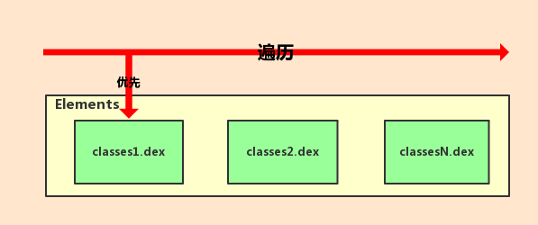

## 3、代码热修复原理

基于上面 ClassLoader 加载类的流程是按顺序遍历 dex 文件，所以把有问题的需要更改的类打包到一个 dex（patch.dex）中去，然后把这个 dex 插入到 Elements 的最前面，这就是代码热更的原理

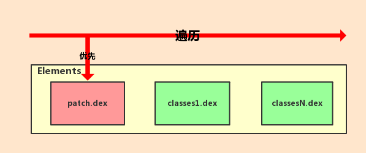

### 3.1、补丁制作

> $ANDROID_HOME/build-tools/x.x.x/

`dx --dex --output=target.jar origin.jar`

### 3.2、Dex 的插入

处理兼容

```java

private static void installDexes(ClassLoader loader, File dexDir, List<File> files)
        throws IllegalArgumentException, IllegalAccessException, NoSuchFieldException,
        InvocationTargetException, NoSuchMethodException, IOException, InstantiationException, ClassNotFoundException {
    if (!files.isEmpty()) {
        if (Build.VERSION.SDK_INT >= 24) {
            V24.install(loader, files, dexDir);
        } else if (Build.VERSION.SDK_INT >= 23) {
            V23.install(loader, files, dexDir);
        } else if (Build.VERSION.SDK_INT >= 19) {
            V19.install(loader, files, dexDir);
        } else if (Build.VERSION.SDK_INT >= 14) {
            V14.install(loader, files, dexDir);
        } else {
            V4.install(loader, files);
        }
    }
}
```

通过反射，修改应用 `ClassLoader` 的私有成员变量 `pathList` 内的 `dexElements` 数组

```java

private static final class V24 {

    private static void install(ClassLoader loader, List<File> additionalClassPathEntries, File optimizedDirectory)
            throws IllegalArgumentException, IllegalAccessException,
            NoSuchFieldException, InvocationTargetException, NoSuchMethodException, InstantiationException, ClassNotFoundException {

        Field pathListField = findField(loader, "pathList");
        Object dexPathList = pathListField.get(loader);
        Field dexElement = findField(dexPathList, "dexElements");
        Class<?> elementType = dexElement.getType().getComponentType();
        Method loadDex = findMethod(dexPathList, "loadDexFile", File.class, File.class, ClassLoader.class, dexElement.getType());
        loadDex.setAccessible(true);

        Object dex = loadDex.invoke(null, additionalClassPathEntries.get(0), optimizedDirectory, loader, dexElement.get(dexPathList));
        Constructor<?> constructor = elementType.getConstructor(File.class, boolean.class, File.class, DexFile.class);
        constructor.setAccessible(true);
        Object element = constructor.newInstance(new File(""), false, additionalClassPathEntries.get(0), dex);

        Object[] newEles = new Object[1];
        newEles[0] = element;
        expandFieldArray(dexPathList, "dexElements", newEles);
    }
}
```

### 3.3、CLASS_ISPREVERIFIED 问题解决

> 只会在 Dalvik 虚拟机出现，Art 虚拟机上不会出现该问题，而且在 Android5.0 以上源码中搜索 CLASS_ISPREVERIFIED 也是没结果的

```
Class resolved by unexpected DEX: Lcom/dodola/rocoosample/MainActivity;(0xa4f94580):0x96e22000 ref [Lcom/dodola/rocoosample/c;] Lcom/dodola/rocoosample/c;(0xa4f94580):0x96d76000
(Lcom/dodola/rocoosample/MainActivity; had used a different Lcom/dodola/rocoosample/c; during pre-verification)

Process: com.dodola.rocoosample, PID: 6743
java.lang.IllegalAccessError: Class ref in pre-verified class resolved to unexpected implementation
   at com.dodola.rocoosample.MainActivity.onCreate(Unknown Source)
   at android.app.Activity.performCreate(Activity.java:5231)
   at android.app.Instrumentation.callActivityOnCreate(Instrumentation.java:1087)
   at android.app.ActivityThread.performLaunchActivity(ActivityThread.java:2159)
   at android.app.ActivityThread.handleLaunchActivity(ActivityThread.java:2245)
   at android.app.ActivityThread.access$800(ActivityThread.java:135)
   at android.app.ActivityThread$H.handleMessage(ActivityThread.java:1196)
   at android.os.Handler.dispatchMessage(Handler.java:102)
   at android.os.Looper.loop(Looper.java:136)
   at android.app.ActivityThread.main(ActivityThread.java:5017)
   at java.lang.reflect.Method.invokeNative(Native Method)
   at java.lang.reflect.Method.invoke(Method.java:515)
   at com.android.internal.os.ZygoteInit$MethodAndArgsCaller.run(ZygoteInit.java:779)
   at com.android.internal.os.ZygoteInit.main(ZygoteInit.java:595)
   at dalvik.system.NativeStart.main(Native Method)
```

问题描述：假设 A 类在它的 static 方法，private 方法，构造函数，override 方法中直接引用到 B 类。如果 A 类和 B 类在同一个 dex 中，那么 A 类就会被打上 CLASS_ISPREVERIFIED 标记。A 类如果还引用了一个 C 类，而 C 类在其他 dex 中，那么 A 类并不会被打上标记

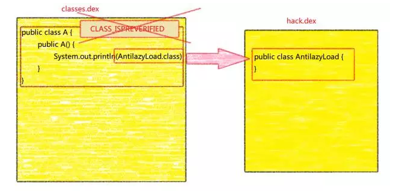

在所有类的构造函数中插入这行代码 `System.out.println(AntilazyLoad.class);`，而 `AntilazyLoad.class` 这个类另外打包成另外一个 dex 文件并在主程序初始化的时候注入

#### 3.3.1、字节码插桩

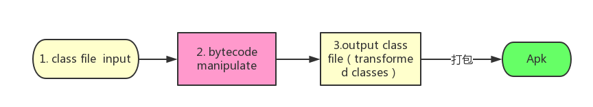

字节码操作类库 ：AMS、javassit

Java 类二进制流数据项按顺序存储在 class 文件中，相邻的项之间没有间隔，包含了许多大小不同的项，由于每一项的结构都有严格规定，这使得 class 文件能够从头到尾被顺利地解析

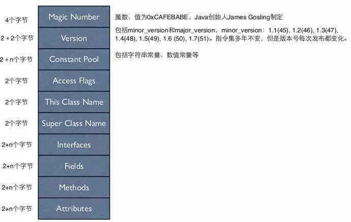

要求：了解字节码

推荐两插件 [jclasslib bytecode viewer](https://github.com/ingokegel/jclasslib) 可以查看 class 文件的整个结构，[ASM Bytecode Outline](https://plugins.jetbrains.com/plugin/5918-asm-bytecode-outline) 直接查看转换成使用 ASM 的代码也可以查看源码的字节码

##### Java 字节码基础和 JVM 指令集

基本数据类型和类对象的类型签名对照表

Type Signature | Java Type
:------------- | :------------------------
Z              | boolean
B              | byte
C              | char
S              | short
I              | int
J              | long
F              | float
D              | double
L              | 类权限定名（如：java/lang/String）
[type          | type[]

比如方法

```
long f (int n, String s, int[] arr);
```

转换成字节码后

```
f(ILjava/lang/String;[I)J
```

另外也可以使用 `jclasslib bytecode viewer` 插件来查看


再看一个例子稍微了解 JVM 指定集：

```
public TestHack() {
     System.out.println(AntiLazyLoad.class);
 }
```

对应的字节码

```
Code:
   0: aload_0                           //将第 0 个 int 型本地变量推送至栈顶
   1: invokespecial #1                  // Method java/lang/Object."<init>":()V
   4: getstatic     #2                  // Field java/lang/System.out:Ljava/io/PrintStream;  
   7: ldc           #3                  // class com/hellocsl/demo/amsdemo/AntiLazyLoad #将 com/hellocsl/demo/amsdemo/AntiLazyLoad 类的常量信息读取并压栈
   9: invokevirtual #4                  // Method java/io/PrintStream.println:(Ljava/lang/Object;)V
  12: return
```

配合[JVM指令集整理](http://www.wangyuwei.me/2017/01/19/JVM%E6%8C%87%E4%BB%A4%E9%9B%86%E6%95%B4%E7%90%86/)来解析

##### ASM 使用

ASM 通过类似于简单的 Visitor 模式按照 class 文件结构依次访问 class 文件的每一部分，在遍历过程中对可以字节码进行修改

需要了解三个对象，`ClassReader`、`ClassVisitor` 和 `ClassWriter`

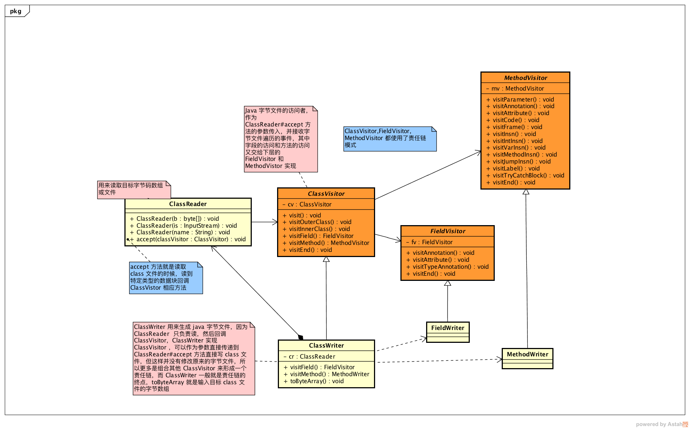

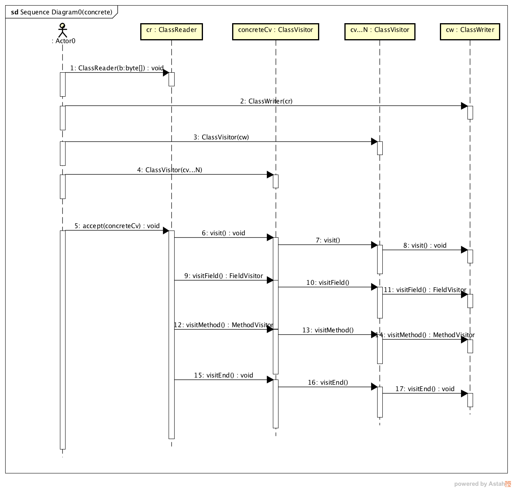

还是上面的例子，使用 `ASM Bytecode Outline` 插件得出 `ASM` 对应的代码

```java
MethodVisitor mv = cw.visitMethod(ACC_PUBLIC, "<init>", "()V", null, null);
mv.visitCode();
//...
Label l1 = new Label();
mv.visitLabel(l1);
mv.visitFieldInsn(GETSTATIC, "java/lang/System", "out", "Ljava/io/PrintStream;");   //方法静态字段命令，System.out
mv.visitLdcInsn(Type.getType("Lcom/hellocsl/demo/amsdemo/AntiLazyLoad;"));  //将 com/hellocsl/demo/amsdemo/AntiLazyLoad 类的常量信息读取并压栈
mv.visitMethodInsn(INVOKEVIRTUAL, "java/io/PrintStream", "println", "(Ljava/lang/Object;)V", false);  //执行方法 System.out.println 参数就是当前栈顶的
Label l2 = new Label();
mv.visitLabel(l2);
mv.visitInsn(RETURN);
//...
mv.visitEnd();
```

最后的代码

```java

public static byte[] referHackWhenInit(InputStream inputStream) {
    ClassReader cr = new ClassReader(inputStream);
    ClassWriter cw = new ClassWriter(cr, ClassWriter.COMPUTE_MAXS);
    boolean hasHackSuccess = false;
    boolean isInterface = false;
    ClassVisitor cv = new ClassVisitor(Opcodes.ASM4, cw) {
        @Override
        void visit(int version, int access, String name, String signature, String superName, String[] interfaces) {
            super.visit(version, access, name, signature, superName, interfaces)
            //检查类型
            isInterface = (access & Opcodes.ACC_INTERFACE) != 0;
        }

        @Override
        public MethodVisitor visitMethod(int access, String name, String desc,
                                         String signature, String[] exceptions) {
            MethodVisitor mv = super.visitMethod(access, name, desc, signature, exceptions);
            mv = new MethodVisitor(Opcodes.ASM4, mv) {
                @Override
                void visitInsn(int opcode) {
                    if (("<init>".equals(name) || "<clinit>".equals(name)) && opcode == Opcodes.RETURN && !hasHackSuccess) {
                        //  第一次尝试hack
                        Label l1 = new Label();
                        mv.visitFieldInsn(Opcodes.GETSTATIC, "java/lang/Boolean", "FALSE", "Ljava/lang/Boolean;");
                        mv.visitMethodInsn(Opcodes.INVOKEVIRTUAL, "java/lang/Boolean", "booleanValue", "()Z", false);
                        mv.visitJumpInsn(Opcodes.IFEQ, l1);
                        mv.visitFieldInsn(Opcodes.GETSTATIC, "java/lang/System", "out", "Ljava/io/PrintStream;");
                        mv.visitLdcInsn(Type.getType("Lcom/dodola/rocoo/Hack;"));
                        mv.visitMethodInsn(Opcodes.INVOKEVIRTUAL, "java/io/PrintStream", "println", "(Ljava/lang/Object;)V", false);
                        mv.visitLabel(l1);
                        hasHackSuccess = true;
                    }
                    super.visitInsn(opcode);
                }
            }
            return mv;
        }
    };
    cr.accept(cv, 0);
    if (!hasHackSuccess && !isInterface) {
        // has not hack and not interface
        // 第二次尝试hack  这个有问题 先关闭
        //return addCinitAndHack(cr,cw);
        return cw.toByteArray();
    } else {
        return cw.toByteArray();
    }
}
`
```

#### 3.3.2、副作用

Dalvik 下影响类的加载性能，Art 下类地址写死，导致必须包含父类/引用类，最后补丁包很大

### 3.3、自动化

上面说的各个步骤如果都是人工去完成，操作性很差且容易出错，但可以入侵打包流程，实现自动化流程

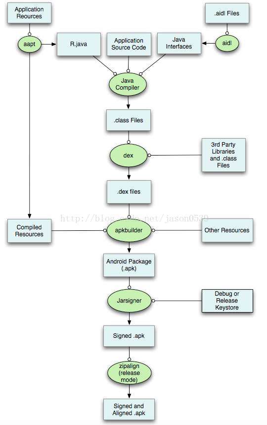

目标：找到 class 转化成 dex 的 Task，进行字节码插桩

最直接的方式是在 As 中执行一次打包操作，观察 Gradle console 中 Task 的执行

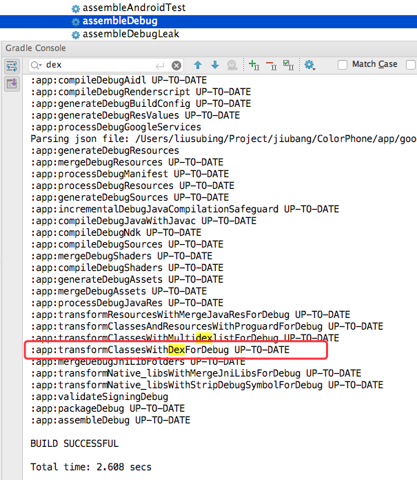

> 根据 [gradle transform](http://tools.android.com/tech-docs/new-build-system/transform-api) 中提到，Android Gradle plugin 在 1.5 开始允许第三方 Gradle 插件可以在 .class 文件打包成 dex 文件前操控 .class 文件，目的是简化自定义 class 注入，而不再需要操作 Task，而且过程也变得更灵活了

还需要处理以下两个问题

#### 3.3.2 代码混淆后的 patch 包处理

使用基线包的 mapping.txt 文件打包

```java

private static Map applyMapping(Project project, BaseVariant variant, Task proguardTask) {
    Map hashMap
    RocooFixExtension rocooConfig = RocooFixExtension.getConfig(project);
    if (rocooConfig.preVersionPath != null) {
        /**
         * 需要基于某个存在的版本打补丁包
         */
        def preVersionPath = new File("${project.projectDir}${File.separator}rocoofix${File.separator}version" + rocooConfig.preVersionPath)
        if (preVersionPath.exists()) {
            // 获取基线包的 mapping 文件
            def mappingFile = new File("${preVersionPath}${File.separator}${variant.dirName}${File.separator}${MAPPING_TXT}")
            if (mappingFile.exists()) {
                if (proguardTask instanceof ProGuardTask) {
                    if (mappingFile.exists()) {
                        proguardTask.applymapping(mappingFile)
                    }
                } else {//兼容gradle1.4 增加了transformapi
                    def manager = variant.variantData.getScope().transformManager;
                    def proguardTransform = manager.transforms.find {
                        it.class.name == ProGuardTransform.class.name
                    };
                    if (proguardTransform) {
                        proguardTransform.configuration.applyMapping = mappingFile
                    }
                }
            }
        }
        //...
        return hashMap;
    }
}
```

#### 3.3.1、判断类是否需要更新

正常打包的时候记录下所有类的的 hash 值，打 patch 的时候再去对比

```groovy
RocooFixPlugin#applyTask

//...
//不处理不开混淆的情况
//intermediates/classes/debug
def extensions = [SdkConstants.EXT_CLASS] as String[]
//获取参与打包成 dex 文件的 .class 文件
def inputClasses = FileUtils.listFiles(inputFile, extensions, true);
inputClasses.each {
    inputClassFile ->
        def classPath = inputClassFile.absolutePath
        //初步过滤
        if (classPath.endsWith(".class") && !classPath.contains("/R\$") && !classPath.endsWith("/R.class") && !classPath.endsWith("/BuildConfig.class")) {
            //判断是否参与热修复的类
            if (NuwaSetUtils.isIncluded(classPath, includePackage)) {
                //判断是否要排除的类
                if (!NuwaSetUtils.isExcluded(classPath, excludeClass)) {
                    //获取 class 文件插桩后的字节数组
                    def bytes = NuwaProcessor.processClass(inputClassFile)
                    if ("\\".equals(File.separator)) {
                        classPath = classPath.split("${dirName}\\\\")[1]
                    } else {
                        classPath = classPath.split("${dirName}/")[1]
                    }
                    //获取 class 文件插桩后的字节数组的 hash 值
                    def hash = DigestUtils.shaHex(bytes)
                    //记录 hash 值，格式 class 的全限定名：hash 值
                    hashFile.append(RocooUtils.format(classPath, hash))
                    //基于基线包的 hash 文件进行对比
                    if (RocooUtils.notSame(hashMap, classPath, hash)) {
                        //对新增的或者更新过 class 文件保存记录在 patch 目录
                        def file = new File("${patchDir}${File.separator}${classPath}")
                        file.getParentFile().mkdirs()
                        if (!file.exists()) {
                            file.createNewFile()
                        }
                        FileUtils.writeByteArrayToFile(file, bytes)
                    }
                }
            }
        }

}
//...
```

## 4、扩展、思考

### 4.1、使用接口的形式实现功能插件（没有四大组件的）

通过反射的方式调用

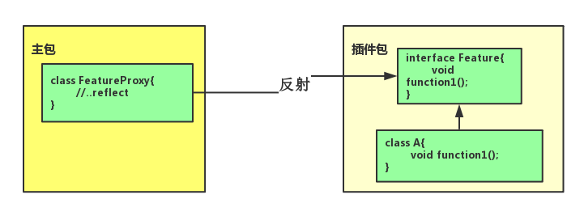

通过接口的形式调用，使用 provided 提供编译

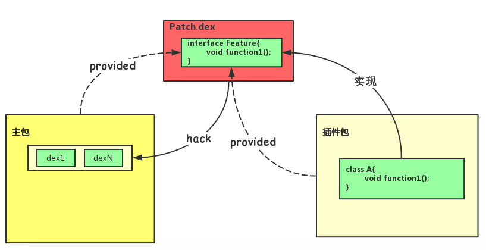

## 5、参考

- [《深入探索 Android 热修复技术原理》- 阿里巴巴]()
- [安卓App热补丁动态修复技术介绍](https://zhuanlan.zhihu.com/magilu/20308548)
- [HotFix](https://github.com/dodola/HotFix)
- [RocooFix](https://github.com/dodola/RocooFix)
- [AOP 的利器：ASM 3.0 介绍](https://www.ibm.com/developerworks/cn/java/j-lo-asm30/)
- [Android AOP之字节码插桩](https://www.jianshu.com/p/c202853059b4)
- [在AndroidStudio中自定义Gradle插件](http://blog.csdn.net/huachao1001/article/details/51810328)
- [混淆实操--手把手教你用applymapping](http://blog.hacktons.cn/2016/06/21/how-to-use-applymapping/)
- [JVM指令集整理](http://www.wangyuwei.me/2017/01/19/JVM%E6%8C%87%E4%BB%A4%E9%9B%86%E6%95%B4%E7%90%86/)


